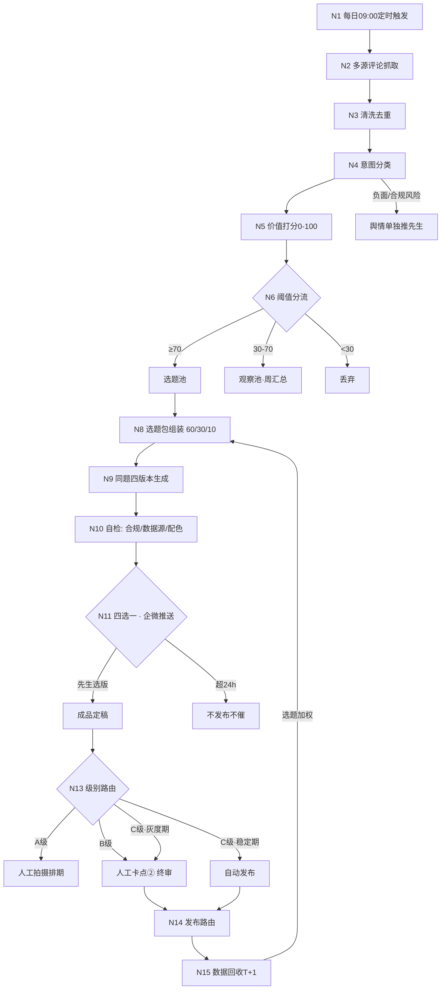

# 58-评论驱动内容生产SOP-抓取判断四选一流水线

> **版本：** V1.0
> **日期：** 2026-09-26
> **用途：** 定义「评论抓取 → 判断分流 → 四选一 → 内容生成 → 人工审核 → 发布 → 回收」全流程，可直接翻译为节点式工作流（ComfyUI / LibLib 工作流 / n8n / Dify）
> **核心原则：** 全自动跑采集与生成，**人只出现在两个卡点**——四选一拍板、B级终审
> **关联：** 57-内容运营自动化SOP（分级与发布规则）、56-广告法避坑库、48-KOL筛选、02/35-内容创作SOP、CANON V2.18（品牌口径）、宝藏星球货盘CSV、52周日历

---

## 一、与现有知识库的衔接点

| 输入 | 来源 | 用在哪 |
|------|------|--------|
| 品牌口径/语言钉 | CANON V2.18 | 生成段的 prompt 约束 |
| 合规词库 | 56-SOP 广告法避坑 | 自检节点正则扫描 |
| 选品与价格 | 宝藏星球货盘 CSV | 选品种草类内容取数 |
| 活动信息 | 52周日历 / 五大主线活动库 | 确定性选题命中 |
| 账号数据 | 各平台后台 | 效果回流与选题加权 |
| 分级与发布规则 | 57-SOP | 本流程的下游规则，不重复定义 |

---

## 二、五阶段流程

### 阶段 1：抓取（每日 09:00 触发，全自动）
1. **N1 定时触发**：cron 09:00
2. **N2 多源抓取**：自家账号评论 + 重点竞品账号评论 + 私信/评论关键词（抖音走 CDP 采集，小红书走已有采集通道）
3. **N3 清洗去重**：去广告/水军/重复/已处理，按「内容指纹 + 用户 + 时间窗」去重

### 阶段 2：判断（全自动，Jev & Laya 系统1模型）

> **判断层模型分工（v0.2 修订）**：判断节点不烧云端大模型，按「系统1」逻辑用本地小模型：
> - **Laya（本地）**：默认通道，跑高频低风险判断——意图分类、价值打分、阈值分流；离线、免费、毫秒级
> - **Jev（决策 API）**：第二通道，跑低频复杂复核——黄级以上、阈值边缘（55-70）样本
> - **规则引擎**：兑底层，模型不可用时保证流水线不中断；判定实现见 `decision_engine\jev_laya_decision.py`

4. **N4 意图分类**：六类——提问 / 需求 / 吐槽 / 夸赞 / 选题建议 / 无关（Laya 本地）
5. **N5 价值打分（0-100）**：热度 ×30% + 代表性 ×30% + 可拍性 ×25% + 时效性 ×15%
6. **N6 阈值分流**：≥70 进选题池；30-70 进观察池（周汇总）；<30 丢弃
7. **N7 风险过滤**：命中负面舆情/合规风险 → **单独推送先生**，不进内容池（走舆情通道）

### 阶段 3：生产（全自动）
8. **N8 选题包组装**：确定性选题约 60%（日历/活动/倒计时）+ 评论池选题约 30% + 人给点子约 10%，合并去重后取当日 top3-5
9. **N9 四版本生成**：每个选题固定出 4 版，角度固定——
   - **V1 干货型**（清单/攻略，成交向）
   - **V2 剧情型**（钩子开头/反转，信任向）
   - **V3 挑战/互动型**（评论区站队，认知/活跃向）
   - **V4 福利型**（优惠/限定，转化向）
   每版含：标题 + 正文文案 + 配图 brief（挂 papercut/chart 模板）+ 预估适配平台
10. **N10 自检**：合规正则扫描（56 词库）→ 数据源核对（数字必须可溯源）→ 品牌配色与口径检查 → 输出自检标签（规则层执行，不依赖模型）

### 阶段 4：四选一（**人工卡点 ①**）
11. **N11 企微推送**：4 版本卡片式推送先生，回复编号即选定（1/2/3/4）
12. **N12 超时规则**：24h 未选 → 选题不发布、不催第二次（对齐 57-SOP 异常处理）；活动类硬截止的，由运营提醒一次

### 阶段 5：终审与发布（B 级含 **人工卡点 ②**）
13. **N13 级别路由**：A 级 → 人工拍摄排期；B 级 → 终审卡点；C 级 → 灰度期人审、稳定后自动
14. **N14 发布执行**：小红书自动直发 / 抖音半自动（备料人点发）/ 公众号备料
15. **N15 数据回收（T+1）**：浏览/互动/涨粉回流 → 选题加权 → 回到 N8，形成闭环

---

## 三、流程图（Mermaid）

---

## 四、节点平台落点（ComfyUI / LibLib 工作流）

**诚实结论先说**：ComfyUI 强在「生成段」（尤其出图），抓取和人工卡点不是它的主场。推荐混合架构：

> **外部编排（n8n/Dify/脚本）跑 N1-N8 与 N14-N15 + ComfyUI 跑 N9 出图段 + 企微做两个人工卡点。**
> 若坚持全流程在 ComfyUI 内跑，用 API 触发 + HTTP 节点可实现，但人工卡点必须**把工作流拆成 A/B 两段**（ComfyUI 无原生 human-in-loop）。

| 流程节点 | ComfyUI 落点 | 说明 |
|----------|-------------|------|
| N1 定时触发 | 外部 cron 调 `/prompt` API | ComfyUI 无原生定时 |
| N2 抓取 | Python/HTTP 节点调 CDP 采集脚本 | 或直接在外部编排层做 |
| N3-N7 清洗/分类/打分 | **Laya 本地系统1模型**（判断主通道）+ 规则引擎兑底；黄级以上/边缘样本追加 **Jev API** 复核 | 本地免费毫秒级，判断类节点不烧云端大模型；生成段（N9 文案）才用 LLM API |
| N8 组装 | Python 节点（合并/去重/取top） | 纯逻辑，不必进 ComfyUI |
| N9 文案四版本 | LLM API 节点 ×4 prompt 模板 | 4 个 prompt 固化进模板 |
| N9 配图四版本 | **ComfyUI 主场**：papercut 模板底图 + SDXL 换文案层；或 HTML 模板渲染 | 品牌色板写死进工作流 |
| N10 自检 | Python 正则节点 + LLM 审查节点 | 双通道，任一不过即打回 |
| N11 四选一 | **Workflow A 结束点**：落盘 + 企微推送 | 人工卡点① |
| N13-N14 发布 | **Workflow B**（审核通过后触发）：HTTP 发小红书 / 生成抖音备料包 | 人工卡点② |
| N15 回收 | 外部脚本 T+1 拉数据，写回选题库 | 闭环在编排层 |

**落地建议**：第一版不在 ComfyUI 里追求全流程，先跑通「编排层全自动 + ComfyUI 只出配图」，四选一体验最好（企微卡片点选）。等 V1 稳定后再评估是否把生成段整体迁进节点平台。

---

## 五、风险标注

1. **平台风控**：抓取频率设上限（自家账号只读、竞品账号 ≤3 个/日），CDP 环境固定
2. **LLM 幻觉**：N10 自检双通道；数字类内容必须能指向数据源行，否则打回
3. **四选一变成四不选**：连续 3 天先生未拍板 → 自动降级为「每日只推 1 版最优」，减少决策负担
4. **评论池污染**：水军/互赞群评论会被 N5 代表性权重压下去，每周人工抽查 20 条校准打分
5. **与 57-SOP 冲突时**：分级、发布频率、审核红线以 57 为准，本 SOP 只细化生产链路

---

*定稿端：LOOP-PARK-SOP（GitHub: loop-park-sop）；依据 CANON V2.18；定稿后回流登记 Xloop-KB REGISTRY。*
