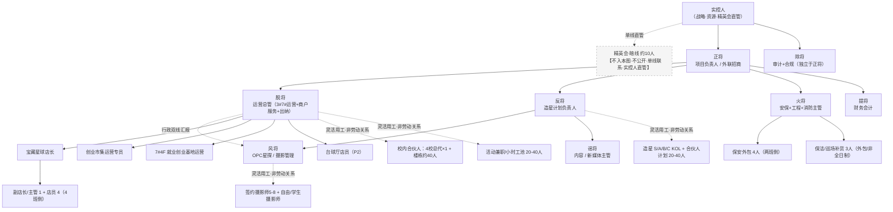
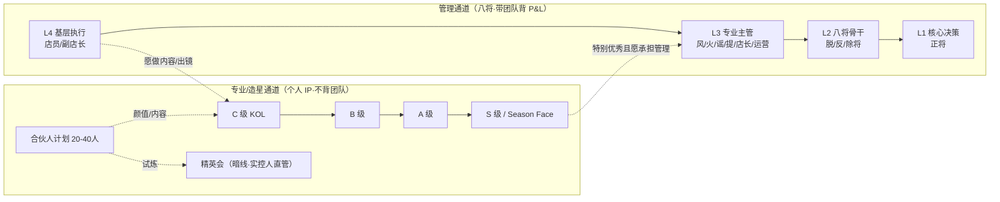
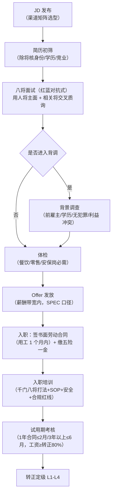

# LOOP PARK 人力资源管理方案

> **版本**：V1.0（2026-09-19）
> **编制**：LoopPark 法务+人力资源负责人
> **适用项目**：西咸新区沣西新城 LOOP PARK 青年商业街区（3# Loop Fun / 7# Loop Lab / 4# Loop Chill，当前约 3 万㎡，规划 10 万㎡）
> **法律基准**：《中华人民共和国劳动合同法》《社会保险法》《职工带薪年休假条例》《关于确立劳动关系有关事项的通知》（劳社部发〔2005〕12 号）、《个人所得税法》及陕西省/西安市现行社保公积金政策。
> **口径说明**：本方案编制、薪酬、人数、成本数字以《统一参数底盘 V1.0（冻结）》为准，与项目已冻结决策（千门八将 8 人、年人力 100 万、年运营预算 400 万、精英会实控人直管、造星不发现金）保持一致。涉及合同文本、补偿测算、社保申报等法律事项，落地前建议经法律顾问与财务复核。

---

## 一、方案总览（一页纸）

### 1. 组织与人的基本盘

| 维度 | 结论 |
|---|---|
| 组织核心 | **千门八将**（正/反/脱/风/火/除/谣/提）8 个做事角色，非固定职位，一人可兼多将 |
| 全职劳动关系 | **17 人**：八将 8 + 宝藏星球 6（店长1+主管1+店员4）+ 市集运营 1 + 就业基地运营 1 + 台球厅店员 1 |
| 外包（非 LOOP 劳动关系） | **8 人**：保安 4（外包公司）+ 保洁 3（外包/小时工）+ 台球厅兼职 1 |
| 灵活用工峰值 | **约 200–350 人**：校内合伙人约 44、造星 KOL 150–270、合伙人计划 20–40、活动兼职 20–40、摄影师流动——**绝大多数不发工资** |
| 三条人才线 | 造星计划（明线 KOL）／精英会（暗线，实控人直管，不入架构图）／合伙人计划（明线执行基石），平行非漏斗 |
| 自营无人化 | 无人小酒馆×4、24H 自习室、雀发潮售货机均 **0 全职**，保洁巡场共用 |

### 2. 钱的基本盘（年度，单位：万元）

| 口径 | 金额 | 说明 |
|---|---|---|
| 固定人力成本 | **约 218** | 八将 100 + 宝藏星球 48 + 市集 10.5 + 就业基地 11.3 + 保安外包 31 + 保洁外包 13 + 台球厅兼职 4 |
| 变动灵活用工 | **约 68** | 造星资源 16.8 + 活动兼职 25 + 摄影师 12 + 合伙人补贴 12 + 校内合伙人管理 2 |
| **年度人力总成本** | **≈ 286** | 占年运营预算 400 万约 **71.5%**；固定 76% / 变动 24% |
| 开业期（前 6 个月） | 约 180 | 先配八将+宝藏星球+保安保洁，P1/P2 业态分阶段补人 |
| 寒暑假弹性 | 下降 15–20% | 停招兼职、压缩小时工、保洁轮休，全职与安全红线不压 |

### 3. 方案设计的五条主线

1. **角色而非职级**：以千门八将做事角色搭组织，监督独立（除将直报实控人），安全一票否决（火将），重大支出正将+除将双签。
2. **小核心、大外围**：17 个全职锚点 + 8 个外包岗，撬动 200–350 名非工资关系的学生/合伙人/KOL/兼职。
3. **法律关系先于用工**：全日制劳动合同只签 17 人；校内合伙人走经销协议、KOL 走资源置换、兼职走非全日制、保安保洁走外包——靠协议与管理方式三件套隔离事实劳动关系。
4. **非物质激励替代高薪**：年轻团队用"大学期间操盘百万项目、The Bunker 圈层、LED 官宣 C 位、从主理人到店主的通道"留人；造星一律资源/礼物不发现金。
5. **成本随业态与季节伸缩**：P0 必配、P1 上线即配、P2 看数据再补；变动成本占 24%，寒暑假自然收缩。

---

## 二、十大模块地图

| 部分 | 模块 | 核心交付 |
|---|---|---|
| **第一部分** | 1. 组织架构设计 | 组织架构图、八将岗位说明书、编制标准、议事决策机制 |
| | 2. 人才盘点与梯队 | L1-L4 分层、造星 SABC、双通道晋升、继任 AB 角、九宫格盘点 |
| | 3. 招聘与配置 | 岗位画像、渠道矩阵、招聘/入职流程、校内合伙人招募、审批权限 |
| **第二部分** | 4. 培训与发展 | 新人 30 天课程表、岗位技能、管理层红蓝对抗、造星/OPC 培训 |
| | 5. 绩效管理 | 周期、OKR+KPI 双轨、八将 KPI 表、强制分布、Season Face 评选、申诉 |
| | 6. 薪酬福利 | 结构比例、L1-L4 带宽、八将现金表、灵活用工报酬、福利、调薪、长期激励 |
| **第三部分** | 7. 员工关系 | 劳动合同、试用期、离职补偿 N/N+1/2N、争议预防、奖惩红线 |
| | 8. 灵活用工管理 | 五类法律关系对照、校内合伙人/KOL/兼职/摄影师/外包协议要点、社保合规、风险隔离 |
| | 9. 企业文化与激励 | 八将文化、合伙人计划、精英会边界、Season Face、非物质激励、团建节奏 |
| | 10. 人力成本测算 | 固定/变动预算总表、业态成本模型、人效指标、分阶段投放、寒暑假降本、预算管控 |

---

## 三、阅读与使用说明

- **落地顺序建议**：先用第一部分定组织与人；用第六部分定钱；用第八部分把所有"来干活的人"按法律关系签对协议；用第十部分做预算盘子。
- **与既有文件衔接**：本方案与《LOOP_PARK 八将议事规则 V1.0》《LOOP_PARK 造星计划_千门八将职责体系 V1.0》一致，不冲突。
- **与法律合规任务衔接**：本方案劳动用工部分为执行框架，合同模板、补偿测算、社保申报口径以法律顾问复核为准；社保按最低基数缴纳的过渡安排已提示合规风险。
- **动态维护**：每年 4 月随经营复盘校准薪酬带宽与预算；西安市社保/公积金政策每年更新时由提将+除将复核。

---

---

# 第一部分 组织架构 · 人才梯队 · 招聘配置

> 适用对象：西咸新区沣西新城 LOOP PARK 青年商业街区（3# Loop Fun / 7# Loop Lab / 4# Loop Chill，约 3 万㎡）。
> 法律基准：中国大陆现行劳动法律法规（《劳动合同法》《社会保险法》《职工带薪年休假条例》、劳社部发〔2005〕12 号、《个人所得税法》及陕西省/西安市社保公积金政策）。
> 口径声明：本章节全部编制、人数、薪酬数字严格采用 `_hr_draft/_SPEC.md`（冻结版 V1.0）；与该底盘不一致处已在文末"口径核对"逐条标注，不擅自补编。

---

## 模块 1 组织架构设计

### 1.1 组织设计总原则

LOOP PARK 不是传统"总部—部门—班组"科层，而是一套**以"千门八将"做事角色为核心、实控人直管、灵活用工占比高**的创业型组织。设计上坚持四条：

1. **将不是岗，是角色**：正/反/脱/风/火/除/谣/提是八种做事逻辑，一人可兼多将、一将可多人分担；组织图上标注"谁在担这个将"，而非"这个岗位在谁头上"。
2. **三线平行，不是漏斗**：造星计划（明线 KOL 引流）／精英会（暗线校园领头羊）／合伙人计划（公开招募执行）三线并行；**精英会由实控人单线直管、不聚餐、不公开、不建群，不进入本组织架构图**。
3. **劳动关系与合作关系严格分开**：全职签劳动合同缴五险一金；校内合伙人、造星 KOL、摄影师、活动兼职一律签非劳动协议（经销/合作/服务/劳务/实习），协议中不约定考勤、坐班、固定工资，避免被认定事实劳动关系。
4. **监督独立**：除将（审计合规）直接向实控人汇报，独立于正将，不受其他将干预。

### 1.2 组织架构图（实控人 → 八将 → 在岗团队 / 外包 / 灵活用工网络）

**汇报线说明：**

| 线条 | 汇报关系 | 说明 |
|---|---|---|
| 实线·行政 | 实控人→正将→脱将→宝藏星球/市集/就业基地/台球厅 | 经营主汇报线 |
| 实线·独立 | 实控人→除将 | 除将不隶属正将，对审计合规负独立责任 |
| 双线 | 风将：业务→反将，行政→脱将 | 业务归造星线，日常行政归运营线 |
| 实线·专业 | 火将→保安/保洁外包 | 业务调度归火将，劳动合同与社保由外包公司承担 |
| 虚线·合作 | 脱将/反将/风将→各类灵活用工 | 非劳动关系，走经销/合作/服务/劳务/实习协议 |
| 暗线 | 实控人⇢精英会 | 单线联系，不入图、不公开、不聚餐、不建群 |

### 1.3 千门八将岗位说明书

> 薪酬带宽严格采用 `_SPEC.md` §3.2/§3.3；KPI 为 LOOP PARK 业务结合指标，不另设考核奖金口径。

| 将 / 岗位 | 核心职责 | 汇报对象 | 关键 KPI（举例口径） | 任职资格 | 权限边界与红线 |
|---|---|---|---|---|---|
| **正将**（项目负责人/外联招商） | 政府·学校·招商·融资；对外搞资源；八将会议发起与拍板 | 实控人 | 招商出租率、政府/学校资源落地数、项目里程碑达成、年度预算执行 | L1 核心决策，能带团队、能对接政企、有商业街区/校园渠道资源者优先 | 对经营结果负总责；**重大支出须与除将双签**；不得绕开除将自行立项大额支出 |
| **脱将**（运营总管） | 3#/7# 楼栋运营、商户服务、出纳；对内搞运营；八将周会主持与纪要 | 正将 | 楼栋客流/销售达成、商户满意度、出纳日清月结准确率、活动现场闭环 | L2 八将骨干，零售/商业街区运营经验，细心、能扛现场 | 兼出纳但**不得兼管对账复核**（提将核算、除将复核）；无独立大额支出权 |
| **反将**（造星计划负责人） | 明线 KOL 运营、Season Face、网红打卡引流；对人搞流量 | 正将 | 造星 S/A/B/C 各级在册人数、SF 季度引流效果、内容曝光与到店转化 | L2 八将骨干，熟悉 MCN/校园达人玩法，年轻、懂学生审美 | **造星只给礼物/资源，绝不发现金**；不得承诺"进正式员工"为福利 |
| **风将**（OPC 星探/摄影管理） | 网红打卡路线、星探选人、签约/自由/学生摄影师管理；对眼搞曝光 | 业务→反将；行政→脱将 | 月度星探入库人数、签约摄影师履约出片组数、打卡点拍摄产出 | L3 专业主管，摄影/模特经纪或校园星探经验 | 摄影师一律按次/按服务结算；不得用固定工资/考勤方式用工 |
| **火将**（安保+工程+消防主管） | 安保、工程维修、消防、派出所对接；对事搞安全 | 正将 | 安全责任事故 0、消防年检/隐患整改闭环、外包安保保洁巡场合格率 | L3 专业主管，持消防/安保相关资质，能两班倒调度外包 | **现场处置有一票否决权**：发现重大安全/消防隐患可当场叫停活动，事后报备；其他将不得干扰其安全决定 |
| **除将**（审计+合规，可兼职/外包） | 财务复核、合规审查、风险控制；对账搞监督 | 实控人（独立于正将） | 审计覆盖率、合规问题按期关闭率、双签执行率 | L2，具备审计/法务/财务合规背景，可兼职或顾问 | **独立性红线**：不得被任何将干预审计；**重大支出正将+除将双签方可执行**；对违法用工/账外收款有一票否决上报权 |
| **谣将**（内容/新媒体主管） | 短视频、社群、内容分发；对嘴搞传播 | 反将（业务） | 全渠道粉丝增长、内容曝光/互动、社群活跃与转化 | L3 专业主管，会拍剪写、懂平台投放 | 内容不得碰网贷/医疗/低俗；数据必须真实，不得刷量造假 |
| **提将**（财务会计） | 会计、对账、预算、成本核算；对钱搞核算 | 正将 | 账务准确率、预算执行偏差率、报表及时率（月结） | L3 专业主管，持会计从业能力，细心合规 | 只核算不审批；所有付款须有除将复核痕迹；出纳由脱将担任，会计出纳分离 |

**权限红线汇总（必须上墙）：**

- 除将独立，不受正将及任何将干预审计工作；
- 火将对安全/消防隐患有**当场一票否决**权；
- **任何重大支出必须正将 + 除将双签**方可执行；
- 提将（会计）与脱将（出纳）不得一人兼任；
- 八将议事内容保密，不得对外泄露；
- 精英会事务仅实控人可介入，八将不得过问。

### 1.4 编制标准与分阶段配齐节奏

**编制总盘子（来自 SPEC §2 冻结口径）：全职 17 人 + 外包 8 人 + 灵活用工池（峰值约 200-350 人，绝大多数不发工资）。**

> 下表按 SPEC §2.1/§2.2 冻结名册逐行照列；全职 17 人 = 八将 8 + 宝藏星球 6 + 市集运营 1 + 就业基地运营 1 + 台球厅店员 1。

#### 1.4.1 全职/劳动关系人员（签订劳动合同、缴五险一金）

| 板块 | 岗位 | 编制 | 归属将/汇报 | 用工性质 |
|---|---|---|---|---|
| 核心团队 | 正将（项目负责人/外联招商） | 1 | 实控人 | 劳动合同 |
| 核心团队 | 脱将（运营总管/商户服务/出纳） | 1 | 正将 | 劳动合同 |
| 核心团队 | 反将（造星计划负责人） | 1 | 正将 | 劳动合同 |
| 核心团队 | 风将（OPC 星探/摄影管理） | 1 | 反将（业务）/脱将（行政） | 劳动合同 |
| 核心团队 | 火将（安保+工程+消防主管） | 1 | 正将 | 劳动合同 |
| 核心团队 | 除将（审计+合规） | 1 | 实控人（独立于正将） | 劳动合同/顾问 |
| 核心团队 | 谣将（内容/新媒体主管） | 1 | 反将（业务） | 劳动合同 |
| 核心团队 | 提将（财务会计） | 1 | 正将 | 劳动合同 |
| 宝藏星球 | 店长 | 1 | 脱将 | 劳动合同 |
| 宝藏星球 | 副店长/主管 | 1 | 宝藏星球店长 | 劳动合同 |
| 宝藏星球 | 店员（收银/理货/上架，4 班倒） | 4 | 宝藏星球店长 | 劳动合同 |
| 市集/就业 | 创业市集运营专员 | 1 | 脱将 | 劳动合同 |
| 市集/就业 | 7#4F 就业创业基地运营 | 1 | 脱将 | 劳动合同 |
| 自营 | 台球厅店员（P2，可兼职小时工） | 1 | 脱将 | 劳动合同/劳务 |
| **冻结在册合计** | | **17 人** | | |

#### 1.4.2 外包/非全日制人员（不与 LOOP 建立劳动关系）

| 板块 | 岗位 | 规模 | 用工形式 |
|---|---|---|---|
| 安保 | 保安员 | 4 人（两班倒） | 保安公司外包（不缴社保，付外包费） |
| 保洁 | 保洁/巡场补货员 | 3 人 | 外包/非全日制小时工，覆盖 3#4#7# 及无人业态补货 |
| 台球厅 | 兼职店员 | 1 | 劳务报酬/小时工 |
| **外包合计** | | **8 人** | |

#### 1.4.3 灵活用工 / 合作关系（非劳动关系，详见模块 3）

| 类型 | 规模 | 合作形式 | 报酬/激励 |
|---|---|---|---|
| 校内合伙人·校园总代 | 4 校×1=4 人 | 经销合作协议，保证金 5000 元/人 | 批发价差（LOOP 供货毛利 15%）+ 季度达标返 1-2%，无工资 |
| 校内合伙人·楼栋合伙人 | 约 40 人（每校 8-12 栋） | 经销合作协议，保证金 1000 元/人 | 零售/团购价差，无工资 |
| 造星 S/A/B/C 级 | S 3-5 / A 10-15 / B 30-50 / C 100-200 | 经纪/合作/社群协议（非劳动） | 一律礼物/资源置换，不发现金 |
| 合伙人计划（公开招募） | 20-40 人 | 实习/劳务/合作协议 | 活动补贴 80-150 元/场 + 利润 10-20% 分成，无固定月薪 |
| 活动执行兼职/小时工 | 池 20-40 人 | 非全日制/劳务协议 | 18-25 元/时，按场结算 |
| 签约摄影师 | 5-8 人 | 摄影服务合同 | 300-800 元/次 |
| 自由/学生摄影师 | 流动 | 内容授权/实习 | 休息补给+低价饮品换授权；学生实习可开实习证明 |
| 精英会（暗线） | 约 10 人 | 实控人单线，不签 LOOP 制式合同 | 钱/权/资源/带教（实控人自管） |

#### 1.4.4 分阶段配齐节奏（开业期 / P1 / P2）

| 阶段 | 时间窗 | 全职配齐 | 外包配齐 | 灵活用工 | 阶段人力成本口径（冻结） |
|---|---|---|---|---|---|
| **开业期** | 前 6 个月 | 八将 8 + 宝藏星球 6 = **14 人** | 保安 4 + 保洁 3 = **7 人** | 校内合伙人先试点 2 校；造星/兼职小池跑通 | 约 180 万（八将100+宝藏星球48+保安31+保洁13 量级） |
| **P1** | 开业后业态补齐 | +市集运营 1 +就业基地运营 1 = **16 人** | 7 人（不变） | 校内合伙人扩至 4 校总代+楼栋约 40 人；造星 SABC 满编 | 进入固定小计约 218 万 |
| **P2** | 台球厅等新自营 | +台球厅店员 1 = **17 人** | +台球厅兼职 1 = **8 人** | 合伙人计划/兼职池随活动波动放大 | 固定小计约 218 万 + 变动约 68 万 ≈ 286 万/年 |

> 寒暑假弹性：停招兼职、压缩小时工，灵活用工成本可弹性下降约 15-20%；全职 17 人/外包 8 人编制不随假期裁撤。

> **说明（编制口径，已冻结）**：全职编制以 §2.1 冻结名册为准，逐行清点为 **17 人**（八将 8 + 宝藏星球 6 + 市集运营 1 + 就业基地运营 1 + 台球厅店员 1），§4.1 固定人力成本 218 万亦对应此 17 人。开业期先配齐八将 8 + 宝藏星球 6 = 14 人，P1 补齐市集/就业基地运营至 16 人，P2 补台球厅店员满编 17 人。后续如需扩编（如行政人事支持岗、活动运营储备岗），由正将提案、除将合规审查、实控人批准后再增列，不在本期冻结编制内。

### 1.5 议事与决策机制（嵌入组织）

| 机制 | 频率/召集 | 参与人 | 核心议程 | 决策规则 |
|---|---|---|---|---|
| **八将周会** | 每周一 | 八将全员（脱将主持） | 上周数据复盘（客流/销售/活动）→ 各将 5 分钟汇报 → 本周议题红蓝对抗 → 拍板分工 | 正将拍板，除将做合规/风险提示；脱将 24h 内出纪要 |
| **月度经营会** | 每月初 | 八将全员 + 实控人 | 月度复盘、预算执行、战略调整、重大人事/立项 | 正将汇报，实控人定调；S 级造星降级、精英会进出须实控人确认 |
| **专题会** | 按需 | 相关将参加（不要求全员） | 单项目/单事件（如大活动立项、临期食品安全、合伙人违规处置） | 主导将提案，至少一轮红蓝对抗；涉及大额支出仍走正将+除将双签 |

**决策闭环 SOP（新项目/大活动立项）**：正将提案 → 反将（引流价值）/脱将（运营可行）/风将（传播价值）/火将（安全）/除将（合规）/谣将（传播）/提将（成本）分头评估 → 红蓝对抗 → 正将拍板 → 脱将落地分工 → 除将全程监督 → 提将复盘核算。

---

## 模块 2 人才盘点与梯队

### 2.1 全职人才四级分层标准（L1–L4，对应 SPEC §3.2）

> 分层只定"能力/业绩/潜力"标准与晋升门槛，薪酬带宽一律沿用 SPEC §3.2，本表不另设薪数。

| 职级 | 对应岗位 | 能力标准 | 业绩标准 | 潜力标准 |
|---|---|---|---|---|
| **L1 核心决策** | 正将 | 能对接政企/融资、能带八将班子、能在模糊局面拍板 | 年度招商/运营/预算目标整体达成，重大风险零失控 | 具备操盘更大体量街区/复制模式的潜质 |
| **L2 八将骨干** | 脱将、反将、除将 | 能独当一条线、能带 1-2 名主管、对本将 KPI 负责 | 本条线季度目标连续达成，能产出可复用 SOP | 可向 L1 接班人培养，具备轮岗/兼将空间 |
| **L3 专业主管** | 风将、火将、谣将、提将、宝藏星球店长、市集运营、就业基地运营 | 专业扎实、能带一线小组、能独立做现场/内容/财务闭环 | 本条线月度目标达成，关键差错率低于红线 | 可升任八将（L2）或资深专家，有跨将协作能力 |
| **L4 基层执行** | 宝藏星球副店长/主管、店员、台球厅店员 | 按 SOP 执行、服务规范、能带新人 | 门店销售/服务指标达成，考勤与盘点无差错 | 可升 L3 主管，或转岗造星/合伙人通道 |

### 2.2 造星计划 S/A/B/C 四级运营人才分层（与造星 skill 一致）

| 级别 | 人数 | 月均资源投入（冻结） | 核心策略 | 权益 | 升降级规则 |
|---|---|---|---|---|---|
| **S 级** | 3-5 人 | 合计 1 万元/月（礼物/拍摄/造型/曝光，不发现金） | 堆资源、专属摄影师、专属造型、最高曝光 | 独享摄影师、礼物每周一套、品牌合作 | 连续 2 个月数据**前 20% 升级**；降级须实控人确认 |
| **A 级** | 10-15 人 | 合计 3000 元/月 | 制造"向上爬"的欲望，对标 S 级 | 共享摄影师、节日礼物、部分品牌合作、曝光优先 | 连续 2 个月前 20% 升 S；连续 2 个月后 20% 降 B |
| **B 级** | 30-50 人 | 合计 1000 元/月 | 不给钱、制造危机感，追 A 级 | 基础拍摄机会、节日小礼、活动门票 | 连续 2 个月前 20% 升 A；连续 2 个月后 20% 降 C |
| **C 级** | 100-200 人 | 低成本免费单 | 免费基础拍摄+付费升级服务筛选真意愿 | 免费基础拍摄、付费升级、活动资格、社群准入 | **连续 3 个月无提升即移出造星计划** |

> 红线：造星一律实物/资源置换，合作协议中写成"资源置换/内容合作"，绝不出现现金报酬条款；不搞纯选美，Season Face 女线按颜值 40%+身材 30%+营销 30% 综合评，学生投票占 20%。

### 2.3 双通道晋升：管理通道 + 专业/造星通道

**晋升试炼路径：**

- 合伙人 → 精英会：公开招募执行半年以上，由实控人单线观察，交办 1 个"小任务"试炼（能力+忠诚度），通过后纳入精英会；**不公开、不聚餐、不建群、单线联系**。
- 合伙人 → 造星计划：颜值/内容达标者，经 OPC 星探提名进入 C 级，按 S/A/B/C 规则晋级。
- 造星 S 级 / 校园骨干 → 全职：**不是承诺、不是必经之路**，仅在本人愿承担管理责任且八将岗有空缺时双向选择；协议中不得把"转正式员工"写成福利条款。

### 2.4 继任计划（AB 角 + 校内合伙人毕业交接）

| 关键岗 | A 角（现任） | B 角（继任备份） | 备份要求 |
|---|---|---|---|
| 正将 | 现任正将 | 脱将（次席） | 脱将须熟悉招商/政企对接，每季度代行 1 次对外汇报 |
| 脱将 | 现任脱将 | 宝藏星球店长 | 店长须熟悉商户服务与出纳流程 |
| 反将 | 现任反将 | 谣将 | 谣将须掌握 SABC 运营与 SF 评选节奏 |
| 提将 / 出纳 | 提将（会计）+ 脱将（出纳） | 除将可临时复核账务 | 钱账分离长期保持，不得一人通吃 |
| 火将 | 现任火将 | 保安外包队长（业务代行） | 外包队长持消防知识，应急可现场指挥 |

**校内合伙人毕业交接 SOP：**

1. 校园总代/楼栋合伙人**毕业前 1 个月**启动交接；
2. 新总代/楼栋合伙人到位，原任带教 2 周；
3. 库存按 **8 折回收**（宝藏星球统一回收、重新入库）；
4. 保证金（总代 5000 / 楼栋 1000）在账实两清、无账外收款/假货记录后无息退还；
5. LOOP Pass 小程序收款账号移交，社群交接，除将抽查历史对账。

### 2.5 人才盘点表模板（九宫格）

> 每年 6 月、12 月各盘点一次；横轴"业绩"、纵轴"潜力"，每格给出动作。全职按 L1-L4 入格，造星按 S/A/B/C 单独列盘。

| 潜力＼业绩 | 业绩差（后 20%） | 业绩中（中段 60%） | 业绩优（前 20%） |
|---|---|---|---|
| **潜力高** | 观察调岗（看是否放错岗） | **重点培养**（给项目历练） | **高潜高绩效**→ 接班 A 角/升 L2 |
| **潜力中** | 绩效改进计划（PIP，1-2 个月观察期） | 稳定贡献者（保持+补短板） | 业务骨干（给专业纵深/专家通道） |
| **潜力低** | **限期改善或退出**（依法处理，走合同/协商） | 维持本职（不进关键岗） | 老黄牛（给资深岗位，不带兵） |

**盘点维度（每格必填）：** ① 现职级 ② 近两季业绩达成 ③ 潜力评估（学习力/带教欲/野心）④ 所在通道（管理 or 造星/专业）⑤ 下一步动作（晋升/调岗/PIP/移出造星）⑥ 备份人是谁。

---

## 模块 3 招聘与配置

### 3.1 各岗位画像（JD 摘要）

| 岗位 | 一句话画像 | 关键硬条件 | 软素质（青年街区味） | 用工形式 |
|---|---|---|---|---|
| 八将（正/脱/反/风/火/除/谣/提） | 能独当一面的"创业者型"骨干，不是打工心态 | 对应专业/行业经验，正将需政企资源，除将需审计合规背景，火将需消防/安保资质 | 年轻、能扛现场、认千门八将这套打法、对事不对人 | 全职劳动合同 |
| 宝藏星球店长 | 折扣仓店长，把 1200 SKU 卖明白、把合伙人带明白 | 零售/便利店/折扣店店长经验，会盘库、会排班 | 对学生客群敏感，能理货也能讲段子 | 全职劳动合同 |
| 宝藏星球副店长/店员 | 收银理货上架、4 班倒 | 踏实、对数字敏感，学生兼职可（非全日制另算） | 笑脸迎客、手脚快 | 全职劳动合同 |
| 创业市集运营专员 | 把夜市/市集从摊位到氛围做起来 | 市集/活动/招商运营经验 | 会跟摊主/学生打交道，能熬夜出摊 | 全职劳动合同 |
| 7#4F 就业创业基地运营 | 做真实的创业服务，**不做保 offer/包就业/培训贷** | 高校就业/创业孵化/职介经验（须合规意识强） | 懂学生求职心理、守红线 | 全职劳动合同 |
| 台球厅店员（P2） | 开台摆球、轻服务 | 可兼职，熟悉台球优先 | 随和、能搭话 | 全职/劳务/小时工 |
| 保安（外包 4 人） | 两班倒守场、巡场、消防配合 | 由保安公司派驻，持证、无犯罪记录 | 对学生友好、不生硬 | 外包（社保由外包公司缴） |
| 保洁/巡场补货（外包 3 人） | 覆盖 3#4#7# 与无人业态补货 | 外包/非全日制，能接受早晚班 | 手脚干净、责任心强 | 外包/非全日制 |
| 校内合伙人（非雇佣） | 想在校园里赚差价的学生带头人 | 在校大学生，有宿舍/社群/楼栋资源 | 肯跑、有信用、守统一收银 | 经销合作协议（非劳动） |

### 3.2 招聘渠道矩阵

> 成本以"相对等级"标注（不另编招聘预算金额，招聘费用并入年运营预算 400 万口径）；到岗周期为参考区间。

| 渠道 | 适用对象 | 相对成本 | 到岗周期 | 备注 |
|---|---|---|---|---|
| **校园招聘**（核心圈 4 校 + 三圈 15 所高校约 21.67 万人） | 合伙人计划、校内合伙人、学生摄影师、活动兼职、应届全职储备 | 低 | 2-6 周（开学季集中） | 与就业基地联动，秋招/春招/开学季三波 |
| **社会招聘**（招聘平台/本地商圈） | 八将骨干、宝藏星球店长、保洁保安主管 | 中 | 2-4 周 | L2/L3 岗为主 |
| **内部推荐**（OPC 星探/合伙人推荐/在职推荐） | 造星 KOL 苗子、活动兼职、合伙人 | 低 | 1-3 周 | 星探本就在校园"扫街"，自带简历 |
| **MCN / 网红渠道** | S/A 级造星、签约摄影师 | 中高（资源置换为主，不发现金） | 2-8 周 | 走合作协议，不走雇佣 |
| **外包公司**（保安/保洁） | 保安 4、保洁 3 | 中（按月付外包费） | 1-3 周 | 必须有资质，工伤/社保由外包公司承担 |
| **实习/勤工助学** | 学生摄影师、行政/内容助理 | 极低 | 随学期 | 签实习协议，不缴社保、可投意外险 |

### 3.3 全职招聘与入职流程（含背调/体检/合同/社保）

**合规要点（红线，不得突破）：**

- 用工之日起 **1 个月内签书面劳动合同**；合同期 1 年试用期 ≤ 2 个月，3 年以上试用期 ≤ 6 个月；**试用期工资 ≥ 转正 80%**；
- 全日制用工依法缴纳五险一金（至少五险），不得以"实习/劳务"名义掩盖事实劳动关系；
- 非全日制（小时工）每日 ≤ 4 小时、每周 ≤ 24 小时，**15 日内结算**工资；
- **禁止招用不满 16 周岁人员**；在校学生勤工助学不视为就业，签实习协议、投意外险；
- 加班依法支付（平日 150%/休息日 200%/法定假日 300%），不使用"无偿加班"表述；
- 试用期解除须有法定理由并留痕，不搞"试用期随意辞退"。

### 3.4 校内合伙人招募流程（非劳动关系）

> 协议红线：不得约定考勤、坐班、固定工资；统一收银（LOOP Pass），账外收款/卖假货即扣保证金并终止合作。

### 3.5 录用审批权限

| 层级 | 招聘发起 | 面试主考 | 审批拍板 | 合规审查 |
|---|---|---|---|---|
| 八将（L1/L2/L3） | 正将或实控人 | 正将 + 除将 + 相关将（红蓝对抗） | **正将拍板**，S 级造星降级/精英会进出由实控人定 | **除将合规审查**（合同/竞业/利益冲突） |
| 宝藏星球店长/市集/就业基地运营（L3） | 脱将 | 脱将 + 正将 | 正将拍板 | 除将抽查 |
| 店员/台球厅店员（L4） | 宝藏星球店长/脱将 | 用人主管 + 脱将 | 脱将拍板，正将备案 | 除将季度抽查 |
| 保安/保洁外包 | 火将 | 火将 + 外包公司 | 火将提需求、正将批预算 | **除将审外包合同与资质**（工伤/社保由外包公司承担） |
| 校内合伙人/造星/合伙人计划/摄影师 | 反将/脱将/风将 | 对应将 | 对应将拍板，重大升级（S 级）报实控人 | 除将审合作协议（确认非劳动关系条款） |

---

## 附：口径核对（与 _SPEC.md 一致性自查）

| 核对项 | 本章节采用值 | SPEC 冻结值 | 一致性 |
|---|---|---|---|
| 八将人数 / 八将年人力 | 8 人 / 100 万 | 8 人 / 100 万 | 一致 |
| 全职编制 | 17 人（八将8+宝藏星球6+市集1+就业1+台球1） | §2.1 逐行 = 17 人 | 一致 |
| 外包人数 | 8 人（保安4+保洁3+台球厅1） | §2.2 = 8 人 | 一致 |
| 宝藏星球团队 | 店长1+主管1+店员4 = 6 人 | §2.1 / §4.1 = 6 人 | 一致 |
| 造星 S/A/B/C 人数与资源 | 3-5/10-15/30-50/100-200；月 1万/3千/1千 | §2.3 / §3.4 一致 | 一致 |
| 校内合伙人 | 总代 4×1 + 楼栋约 40；保证金 5000/1000；毕业前 1 月交接、库存 8 折回收 | §2.3 + treasure-planet SOP | 一致 |
| 年人力总成本 | 固定约 218 + 变动约 68 ≈ 286 万 | §4.3 = 286 万 | 一致 |
| 薪酬带宽 | 全部沿用 §3.2 表，未另设薪数 | §3.2/§3.3 | 一致 |
| 合规红线 | 合同 1 月内签、试用期规则、五险一金、非全日制工时、禁童工、加班费、外包工伤归属 | §五 合规红线 1-10 | 一致 |
| 精英会 | 实控人单线直管、不入架构图、不公开 | §一 / star-making skill | 一致 |

> 本章节全部数字与 `_SPEC.md` 冻结口径一致；后续如新增编制，按"正将提案→除将合规→实控人批准"流程增列，不在本期冻结方案内。

---

# 第二部分 培训发展 · 绩效管理 · 薪酬福利

> 本部分为沣西新城 LOOP PARK 青年商业街区人力资源方案的"发展与激励"篇，覆盖模块 4 培训与发展、模块 5 绩效管理、模块 6 薪酬福利。
> 所有编制、薪酬、人数、成本数字均与《统一参数底盘 V1.0（冻结）》勾稽一致，未另行编制。
> 法律基准：中华人民共和国大陆现行劳动法律法规（《劳动合同法》《社会保险法》《职工带薪年休假条例》劳社部发〔2005〕12 号等），结合陕西省/西安市社保公积金政策与西安最低工资标准。

---

## 模块 4　培训与发展

### 4.1 培训体系总览（三级三层）

LOOP PARK 是年轻创业团队、灵活用工占比高、线上线下结合，培训不能照搬大公司"季度集中上课"模式。本方案采用**"三级课程 × 三类人群 × 四种形式"**的轻量化体系：

| 层级 | 培训对象 | 目标 | 周期 | 主责 |
|---|---|---|---|---|
| L0 入职层 | 所有新入职全职/实习生/合伙人 | 文化、红线、安全、SOP 上手 | 30 天 | 脱将（运营）+ 直属将 |
| L1 岗位层 | 八将各岗、宝藏星球店员、市集摊主 | 专业技能、合规、工具 | 月度滚动 | 各将自训 + 谣将录课 |
| L2 管理层 | 八将骨干、合伙人苗子、精英会苗子 | 红蓝对抗、复盘、带教 | 季度 | 正将 + 实控人 |
| 特色线 | 造星计划 S/A/B/C、OPC 星探 | 内容创作、镜头感、带货、星探方法 | 月度 | 反将 + 风将 |

**四类培训形式（按使用频率排序）：**
1. **师徒制/跟岗**：新人第 3 周全程跟直属将或店长影子学习，占新人课时 40%。
2. **周会复盘**：每周一八将周会后 30 分钟"上周踩坑案例复盘"，不单独排课。
3. **外部讲师/直播**：消防、食品安全、劳动合规、短视频投流等专业课题，季度外聘 1 次，线上直播可回看。
4. **录播微课**：谣将把 SOP 拍成 5-10 分钟短视频，沉淀到企业微信知识库，新员工随到随学。

**培训预算占比**：年度培训费用控制在**年度人力总成本 286 万的 1.5%-2%（约 4-6 万/年）**，其中外部讲师/直播预算 ≤2 万，师徒带教不另发津贴（纳入绩效"带教加分项"），录播微课由谣将兼做不另计成本。该预算不含造星计划资源投入（16.8 万/年，已在变动成本中单列，见模块 6）。

---

### 4.2 新人 30 天入职培训体系

适用对象：所有签订劳动合同的全职新人（八将、宝藏星球店长/副店长/店员、市集运营、就业基地运营、台球厅店员）。实习生、合伙人、小时工按"精简版"参加第 1 周文化/安全 + 第 2 周岗位 SOP 即可。

**试用期合规底线**：劳动合同 3 年以上试用期 ≤6 个月，1 年以下 ≤1 个月；试用期工资 ≥ 转正工资 80%（见模块 6 薪酬表）。

#### 表 4-2-1　新人 30 天入职课程表

| 周次 | 主题 | 课程内容 | 课时 | 形式 | 考核点 |
|---|---|---|---|---|---|
| **第 1 周** 文化/红线/安全 | D1 项目全景 | LOOP PARK 五栋楼/三圈客群/千门八将组织基因/三条人才线（造星·精英会·合伙人） | 4h | 脱将讲授+导览 | 口述组织架构 |
| | D1 合规红线 | 劳动红线（不得用童工/事实劳动关系认定/加班工资）/保密协议/八将议事保密/除将独立性 | 3h | 除将讲授 | 红线笔试 ≥90 分 |
| | D2 消防安全 | 灭火器/消火栓使用、疏散路线、派出所对接人、大型活动安保预案 | 4h | 火将+外部消防讲师 | 实操灭火 1 次 |
| | D2 食品安全 | 宝藏星球临期管理、无人小酒馆酒品溯源、市集摊主食安责任书 | 2h | 店长+除将 | 食安笔试 |
| | D3-D5 跟岗影子 | 跟随直属将完整走一周工作（见八将一周日程表） | 15h | 师徒制 | 交 1 份岗位观察笔记 |
| **第 2 周** 岗位 SOP | 各岗 SOP | 按所在岗位学 SOP 手册（收银/理货/招商话术/内容选题/财务报销/巡检路线） | 20h | 师徒制+录播课 | SOP 抽问 ≥80 分 |
| | 工具培训 | 收银系统、企业微信、客流计数器、抖快小红书后台、库存表 | 6h | 谣将/提将 | 独立操作 1 次 |
| | 服务话术 | 商户/学生/摊主三类客群接待话术、投诉升级路径 | 4h | 脱将 | 情景模拟 |
| **第 3 周** 跟岗实操 | 独立顶岗 | 在师傅在场下独立完成本职工作半天/天 | 20h | 师徒制 | 师傅评分表 |
| | 跨岗轮岗 | 宝藏星球店员轮流跟 1 次市集/活动支持；八将互相跟岗半天 | 8h | 师徒制 | 轮岗小结 |
| **第 4 周** 考核转正 | 理论考核 | 红线+SOP+安全 笔试 | 2h | 脱将监考 | ≥80 分合格 |
| | 实操考核 | 本岗位独立操作（如店员盘点/谣将出 1 条短视频/提将对 1 次账） | 4h | 直属将+除将 | 实操评分 ≥75 |
| | 转正面谈 | 直属将 + 脱将 + 实控人（八将岗）三方面谈，定转正薪资与试用期结论 | 2h | 面谈 | 签署转正表 |

> **总课时**：约 92 课时（约 11.5 个工作日），分散在 4 周内不脱产。试用期内未通过考核者，延长试用期一次（≤法定上限）或按《劳动合同法》第 39 条"不符合录用条件"解除，须在入职时书面明确录用条件。

---

### 4.3 岗位技能培训

#### 4.3.1 八将各岗专业技能培训（月度滚动）

| 将 | 岗位 | 必修技能模块 | 课时/季 | 外部讲师需求 |
|---|---|---|---|---|
| 正将 | 外联招商/融资 | 政府事务、招商谈判、商务礼仪、融资 BP 撰写 | 8h/季 | 招商/融资外部顾问 1 次 |
| 脱将 | 运营总管/商户服务/出纳 | 商户沟通、租约管理、出纳日清、活动现场调度 | 6h/季 | 商业运营外部讲师 1 次 |
| 反将 | 造星计划负责人 | KOL 经纪、内容策略、达人谈判、MCN 合规 | 6h/季 | MCN 行业嘉宾直播 1 次 |
| 风将 | OPC 星探/摄影管理 | 人像摄影、光线/构图、打卡点设计、签约摄影师管理 | 6h/季 | 签约摄影师内部分享 2 次 |
| 火将 | 安保/工程/消防 | 消防年检、安保外包管理、突发事件处置、电梯/用电安全 | 8h/季 | 消防/工程外部年检培训 1 次 |
| 除将 | 审计/合规 | 内审、合同审查、劳动合规、税务基础 | 6h/季 | 律所/会计师事务所讲座 1 次 |
| 谣将 | 内容/新媒体 | 短视频脚本、剪映/PR、抖快小红书投流、社群运营 | 8h/季 | 投流实操直播 1 次 |
| 提将 | 财务会计 | 西安社保公积金政策、小规模纳税人/个体户账务、报销合规 | 6h/季 | 代账公司/税局宣讲 1 次 |

#### 4.3.2 宝藏星球店员培训（收银/理货/陈列/临期/食安）

| 模块 | 内容 | 课时 | 频次 |
|---|---|---|---|
| 收银 | 收银系统操作、扫码/POS、日结对账、退换货流程 | 4h | 入职 + 每季度复训 2h |
| 理货/上架 | 1200 SKU 货盘分区、补货节奏、库存盘点（月度盘点） | 4h | 入职 + 月度盘点前 1h |
| 陈列 | 黄金视线位、主题陈列、网红单品陈列、季节换堆头 | 3h | 入职 + 换主题前 1h |
| 临期管理 | 临期 30/15/7 天三级预警、下架流程、报损单填写 | 2h | 入职 + 每月 1 次 0.5h |
| 食品安全 | 食品保质期识别、散装食品标签、酒水/文创分流、客诉食安上报 | 2h | 入职 + 每半年 1 次 1h |

> 宝藏星球 6 人团队（店长 1 + 副店长 1 + 店员 4）实行"老带新"：每季度由店长组织 1 次全员 2 小时货盘复盘会，除将列席抽查临期管理。

#### 4.3.3 市集摊主培训 SOP

适用对象：创业市集入驻摊主（含校内合伙人、学生主理人）。**注意：摊主不是员工，培训以"运营赋能 + 合规告知"为主，不签劳动条款。**

| 步骤 | 内容 | 频次 | 主讲 |
|---|---|---|---|
| 入驻前 | 市集规则、摊位用电/消防、营业时间、垃圾清运 | 每批摊主入驻前 1 次 1.5h | 市集运营专员 |
| 入驻首周 | 收款码/对账、市集客流规律、爆品选品建议 | 1h | 市集运营专员 |
| 月度 | 主题活动预告、爆品案例分享、食安/合规提醒 | 1h 月度摊主持 | 市集运营 + 谣将 |
| 季度 | 优秀摊主复盘会、选品趋势、跨摊主联动 | 2h | 正将/反将出席 |

---

### 4.4 管理层培养

#### 4.4.1 八将红蓝对抗议事训练

依据《千门八将组织技能》议事规则，把"红蓝对抗"作为管理层固定训练动作：

| 训练场景 | 频率 | 训练内容 | 产出 |
|---|---|---|---|
| 周会红蓝对抗 | 每周一 | 本周重点议题，至少一轮"红方质疑/蓝方辩护" | 会议纪要记录质疑点与回应 |
| 立项红蓝对抗 | 每个新立项 | 八将逐将从自身角色评估可行性与风险（见立项 SOP） | 立项意见书 + 除将风险备案 |
| 季度沙盘 | 每季度 1 次 | 选一个真实失败/成功项目，全员复盘"哪一步判断错了" | 复盘报告 + 改进清单 |

#### 4.4.2 项目复盘机制

- **活动后 72 小时内**：脱将牵头开复盘会，提将出财务数据、谣将出传播数据、火将出安全记录、除将出合规结论。
- **复盘五问**：目标是什么？实际结果？差距多少？原因？下次改什么？
- **沉淀**：每季度由谣将把复盘案例录成 10 分钟微课，进入企业微信知识库。

#### 4.4.3 合伙人/精英会苗子带教机制

| 对象 | 带教人 | 带教方式 | 边界 |
|---|---|---|---|
| 合伙人计划苗子（20-40 人执行层） | 反将 + 脱将 | 活动中手把手带，月度 1 次 1v1 反馈 | 不承诺转正为正式员工 |
| 造星计划 S/A 级苗子 | 反将 + 风将 | 拍摄排期、内容指导、数据反馈 | 资源/礼物激励，不发工资 |
| 精英会苗子（暗线，约 10 人） | **实控人亲自带**，单线联系 | 不聚餐、不建群、不定期沟通 | 八将不得介入（红线） |

> **合规提醒**：合伙人计划与精英会苗子带教，在协议中明确为"实习/合作带教"，不约定固定考勤与固定工资，避免被认定事实劳动关系。

---

### 4.5 造星计划培训模块

依据《造星计划人才体系技能》SOP 1，造星培训按 S/A/B/C 四级分层，资源倾斜不均等（S 级堆资源，C 级付费升级）。

#### 表 4-5-1　造星计划分级培训内容

| 级别 | 人数 | 月资源投入 | 培训内容 | 培训形式 |
|---|---|---|---|---|
| **S 级** | 3-5 人 | 1 万元/月 | 专属摄影师+造型、镜头感训练、带货话术、品牌合作谈判、个人 IP 定位 | 1v1 拍摄指导（风将）+ 月度 1 次外部造型/穿搭课 |
| **A 级** | 10-15 人 | 3000 元/月 | 共享摄影师拍摄、基础镜头感、选题策划、涨粉方法 | 每月 2 次集中拍摄 + 线上群内答疑 |
| **B 级** | 30-50 人 | 1000 元/月 | 基础拍摄机会、节日礼物、活动门票、升级路径讲解 | 每月 1 次集中拍摄 + 社群微课 |
| **C 级** | 100-200 人 | 低成本（免费单） | 免费基础拍摄、付费升级服务（付费拍摄/造型）、活动参与资格 | 社群招募 + 付费服务转化 |

**级别调整规则（与 SOP 1 对齐）：**
- 连续 2 个月数据前 20% → 升级；
- 连续 2 个月数据后 20% → 降级；
- S 级降级须实控人确认；
- C 级连续 3 个月无提升 → 移出造星计划。

#### 4.5.2 OPC 星探培训

| 培训内容 | 课时 | 频次 |
|---|---|---|
| 园区网红打卡路线（每个打卡点最佳角度/光线） | 2h | 风将带教，每新增打卡点复训 |
| 星探沟通话术（搭讪/邀约/拒绝处理） | 2h | 入职培训 + 季度复训 1h |
| 人像摄影基础/签约摄影师管理 | 4h | 季度 |
| 候选人库录入与分级判断（S/A/B/C 画像） | 2h | 月度 |
| 风将每月出"星探报告"：新人发现数/拍摄组数/内容产出数 | — | 月度 |

---

### 4.6 培训形式与预算小结

| 项目 | 年度预算 | 说明 |
|---|---|---|
| 外部讲师/直播 | ≤2 万 | 消防、食安、劳动合规、投流、MCN 等 |
| 师徒制带教 | 0 元（不另发津贴） | 纳入绩效"带教加分" |
| 录播微课 | 0 元（谣将兼做） | 沉淀企业微信知识库 |
| 培训物料/教材 | 1-2 万 | SOP 手册、摊主培训物料、笔试打印 |
| **培训合计** | **约 4-6 万/年** | 占年度人力总成本 286 万约 1.5%-2% |
| （另列）造星计划资源投入 | 16.8 万/年 | (S 1 万 + A 0.3 万 + B 0.1 万)×12 月，属变动成本，不并入培训预算 |

---

## 模块 5　绩效管理

### 5.1 考核周期与对象

| 人群 | 考核周期 | 考核方式 | 考核责任人 |
|---|---|---|---|
| 千门八将（8 人） | 月度 + 季度 + 年度 | 月度 KPI + 季度 OKR + 年度综合 | 正将初评 + 实控人终评；除将独立 |
| 宝藏星球团队（6 人） | 月度 | 门店 KPI（销售/盘点/服务） | 店长初评 + 脱将终评 |
| 市集运营/就业基地/台球厅店员 | 月度 + 季度 | 月度 KPI + 季度 OKR | 脱将 |
| 合伙人计划（20-40 人） | 按项目/活动 | 单场活动评分表 | 活动主导将 + 脱将 |
| 造星计划 KOL（S/A/B/C） | 月度数据 + 季度评选 | 粉丝增长/内容产出/带货数据 | 反将 + 风将 |
| 活动小时工/兼职 | 按场 | 现场考勤 + 活动负责人评分 | 活动负责人 |
| 校内合伙人 | 季度 | 批发流水/动销 | 脱将 + 提将 |
| 签约摄影师 | 按次 | 出片质量/时效 | 风将 |

> 除将考核独立于正将线，直接向实控人汇报，保证审计独立性（红线）。

---

### 5.2 考核方式：OKR + KPI 双轨

- **核心岗（八将）**：季度 3-5 个 **OKR**（Objectives & Key Results，定性目标 + 量化关键结果）+ 月度 **KPI**（数据指标）。
- **执行岗（宝藏星球/市集/就业基地）**：以月度 **KPI** 为主，季度加 1 个 OKR 改进项。
- **灵活用工**：不设 OKR/KPI，按项目/活动评分表执行。

**OKR 示例（八将季度）：**
- 脱将 O：3#/7# 出租率提升。KR1：季度末出租率 ≥90%；KR2：商户满意度 ≥4.3/5；KR3：投诉 24h 内闭环率 100%。
- 反将 O：造星计划引流。KR1：S 级季度新增粉丝合计 ≥10 万；KR2：到店转化（扫码打卡）≥5000 人；KR3：Season Face 曝光 ≥500 万。

---

### 5.3 八将各岗 KPI 示例表

| 将 | 核心 KPI（月度） | 权重 | 数据来源 |
|---|---|---|---|
| **正将** | 招商签约面积（㎡）/ 新签商户数 / 融资进度（到账率）/ 政府关系事项完成率 | 30/25/25/20 | 提将合同台账、融资流水 |
| **反将** | 造星 KOL 涨粉数 / 到店转化（打卡扫码人数）/ Season Face 曝光 / 签约 KOL 数 | 30/25/25/20 | 谣将数据后台、打卡系统 |
| **脱将** | 日均客流 / 商户满意度评分 / 楼栋出租率 / 投诉闭环率 / 现场事故数 | 25/20/25/15/15 | 客流计数器、商户问卷、巡检表 |
| **风将** | 打卡点出片数（组）/ 签约摄影师数 / 星探发现新人数 / 素材使用率 | 30/25/25/20 | 风将星探报告 |
| **火将** | 安全事故数（目标 0）/ 巡检完成率 / 消防隐患整改及时率 / 大型活动安保零事故 | 30/25/25/20 | 火将巡检表、派出所记录 |
| **除将** | 审计发现整改率 / 合规事件数（目标 0）/ 合同审查覆盖率 / 双签执行率 | 30/25/25/20 | 除将审计报告 |
| **谣将** | 内容曝光量（全网）/ 互动率（赞评转）/ 短视频产出数 / 社群活跃数 | 30/25/25/20 | 抖快小红书后台 |
| **提将** | 预算执行率 / 账期完成率 / 报表准时率 / 对账差异率（目标 0） | 30/25/25/20 | 提将财务报表 |

> 宝藏星球店员 KPI 另列：月度销售额（40%）+ 盘点准确率（20%）+ 临期合规（20%）+ 服务评分（20%）。

---

### 5.4 考核结果强制分布与应用

#### 表 5-4-1　强制分布（S/A/B/C/D）

| 等级 | 比例 | 含义 | 绩效系数（占绩效工资） |
|---|---|---|---|
| S | ≤10% | 远超目标，标杆 | 1.5 |
| A | 20% | 超额完成 | 1.2 |
| B | 50% | 达标 | 1.0 |
| C | 15% | 未达标，需改进 | 0.7 |
| D | ≤5% | 严重不达标 | 0 |

> 执行层（L4）人数少，可按"团队整体强制分布 + 个人评分校准"执行，不硬凑比例。

#### 表 5-4-2　结果应用矩阵

| 应用场景 | S | A | B | C | D |
|---|---|---|---|---|---|
| 月度绩效工资 | 1.5 倍 | 1.2 倍 | 1.0 倍 | 0.7 倍 | 0 |
| 季度 OKR 奖金 | 优先 | 正常 | 正常 | 扣减 | 取消 |
| 年度调薪 | 优先调薪 + 特别调薪 | 正常普调 | 正常普调 | 不调薪 | 不调薪 |
| 晋升 | 进入晋升池 | 观察池 | 维持 | 改进期（1 季度） | 改进期/淘汰 |
| 造星计划升级 | 推荐 S/A 级苗子 | 推荐 A/B 级 | — | — | — |
| 合伙人计划推荐精英会 | 优先推荐（实控人定） | 观察 | — | — | 退出 |

> **淘汰合规**：连续 2 个季度 C 或 1 次 D，启动"绩效改进计划（PIP）"1 个月；PIP 后仍不合格，依《劳动合同法》第 40 条"不能胜任工作，经培训或调岗仍不能胜任"解除，须保留培训/调岗记录。不得直接以"末位淘汰"解除（司法实践不支持）。

---

### 5.5 Season Face 季度评选操作表

依据《造星计划人才体系技能》SOP 2。**核心原则：不能搞成纯选美，必须综合营销能力。**

#### 表 5-5-1　Season Face 季度评选流程（12 周）

| 周次 | 阶段 | 动作 | 负责 |
|---|---|---|---|
| 第 1 周 | 提名 | 候选人提名（OPC 星探推荐 + 合伙人推荐 + 自荐）；男线确认三大联赛 MVP 候选（3V3 篮球/电竞/第三联赛），女线至少 5 人 | 风将 + 反将 |
| 第 2-10 周 | 内容期 | 候选人持续发布内容，数据跟踪（涨粉/内容产出/到店打卡） | 反将 + 谣将 |
| 第 11 周 | 评分 | 综合评分（见下表）+ 学生投票 | 反将 + 风将 |
| 第 12 周 | 公布 | 3# 东北角 LED 屏官宣 + 造星计划全渠道推送 | 谣将 |
| 下季度初 | 权益 | 专属拍摄 + 品牌合作洽谈 + 下季度活动 C 位 | 反将 |

#### 表 5-5-2　评分构成

| 线 | 评分项 | 权重 | 评分人 |
|---|---|---|---|
| **男线** | 三大联赛 MVP 三选一（3V3 篮球 / 电竞 / 第三联赛） | 100% | 赛事数据 + 现场观众 |
| **女线** | 颜值 | 40% | 摄影师 + OPC 星探 |
| | 身材/上镜效果/穿搭 | 30% | 摄影师 + OPC 星探 |
| | 营销能力（粉丝增长 + 内容产出 + 带货） | 30% | 数据后台 |
| | **学生投票（叠加项）** | 占总分 20% | 线上投票通道 |

> **防选美化红线**：
> - 女线营销能力占 30%，纯颜值高但无内容产出者不得登顶；
> - 学生投票只占 20%，不能由投票完全决定结果；
> - 男线走"赛事 MVP"路线，不搞颜值投票；
> - 评选标准事前公示，避免黑箱争议。

#### 表 5-5-3　Season Face 权益包

| 权益 | 内容 |
|---|---|
| 季度代言人身份 | 3# LED 屏 1 个月宣发 |
| 专属拍摄 | 风将 + 签约摄影师 1 次大片拍摄 |
| 品牌合作 | 优先对接商户/品牌合作（资源置换，不发现金） |
| 活动 C 位 | 下季度活动开场/主舞台 C 位 |
| 造星升级 | 直接晋升 S 级或 A 级（按原级别） |

---

### 5.6 绩效申诉与校准机制

#### 5.6.1 绩效申诉

| 步骤 | 动作 | 时限 |
|---|---|---|
| 1. 收到评分 | 员工对月度/季度评分有异议 | 评分发布后 3 个工作日内 |
| 2. 书面申诉 | 向脱将提交书面申诉（说明哪项不认可、依据） | — |
| 3. 复核 | 脱将 + 除将 + 直属将三方复核数据 | 5 个工作日内 |
| 4. 结果 | 维持或调整，书面回复；调整须除将备案 | — |
| 5. 终局 | 仍有异议，可向实控人申诉一次 | 再 3 个工作日内 |

#### 5.6.2 绩效校准（季度）

- 每季度末由正将 + 除将 + 脱将 + 实控人召开校准会，防止各将评分宽严不一。
- 除将独立汇报，不受正将干预（红线）。
- 校准后最终结果公示（仅公示等级分布，不公示个人分数）。

---

## 模块 6　薪酬福利

### 6.1 薪酬结构设计（按 SPEC 3.1）

**总结构：基本工资（岗位工资）+ 绩效工资（月度/季度）+ 提成/奖金 + 合伙人/项目分红（仅限核心层）+ 津贴/全勤/餐补。**

#### 表 6-1-1　各层级薪酬结构比例（冻结）

| 层级 | 基本工资 | 绩效工资 | 提成/奖金/分红 | 津贴/全勤/餐补 |
|---|---|---|---|---|
| **核心层（L1-L2 八将骨干）** | 60% | 30% | 项目分红/年终（另列） | 10% |
| **主管层（L3 风/火/谣/提/店长/市集/就业）** | 70% | 20% | 门店/活动提成 | 10% |
| **执行层（L4 副店长/店员/台球厅）** | 80% | 10% | 门店提成 | 10% |

> 说明：10% 津贴项含餐补、全勤、交通/通讯补贴等，不参与绩效浮动。

---

### 6.2 薪酬带宽总表（L1-L4，照 SPEC 3.2 展开）

#### 表 6-2-1　职级与年薪/月薪带宽（税前现金，万元/年）

| 职级 | 对应岗位 | 现金年薪带宽 | 月基本工资参考 | 浮动/绩效 | 调薪节奏 |
|---|---|---|---|---|---|
| **L1 核心决策** | 正将 | 18-25 万 | 11000-14000 元/月 | 项目分红 + 年终奖 | 年度普调 + 项目分红结算 |
| **L2 八将骨干** | 脱将 | 13-16 万 | 8000-9500 元/月 | 季度绩效 + 年终 | 年度普调 + 晋升调薪 |
| **L2 八将骨干** | 反将、除将 | 11-14 万 | 7000-8500 元/月 | 季度绩效 + 年终 | 年度普调 + 晋升调薪 |
| **L3 专业主管** | 风将、火将、谣将、提将、宝藏星球店长、市集运营、就业基地运营 | 8-11 万 | 5500-7500 元/月 | 月度绩效 + 提成 | 年度普调 + 绩效调薪 |
| **L4 基层执行** | 宝藏星球副店长/主管 | 6.5-8 万 | 4500-5500 元/月 | 月度绩效 + 门店提成 | 年度普调 + 门店提成 |
| **L4 基层执行** | 宝藏星球店员、台球厅店员 | 5-6.5 万 | 3800-4500 元/月 | 全勤 + 门店提成 | 年度普调 + 全勤 |

**试用期工资合规**：试用期工资 = 转正基本工资 × 80%，且不低于西安市最低工资标准（以当年公布为准）。

**调薪节奏**：
- 年度普调：每年 4 月（结合上一年度经营与绩效 S/A/B/C/D）；
- 晋升调薪：晋升次月生效，带宽内就近就高套入；
- 特别调薪：年度内有突出贡献（S 级绩效/重大项目）可随时启动，除将备案。

---

### 6.3 八将现金薪酬表（照 SPEC 3.3，与"年人力 100 万"冻结对齐）

#### 表 6-3-1　八将现金年薪中值

| 将 | 现金年薪中值（万） |
|---|---|
| 正将 | 17.5 |
| 脱将 | 13.5 |
| 反将 | 11 |
| 风将 | 9 |
| 火将 | 9 |
| 除将 | 11 |
| 谣将 | 9 |
| 提将 | 7 |
| **现金合计** | **87 万** |

> 按西安社保最低基数缴纳五险一金后，单位承担部分约 **13 万**，**八将年度人力成本合计约 100 万（已冻结）**。

#### 表 6-3-2　八将月薪结构示例（以脱将为例，年薪中值 13.5 万）

| 项目 | 月金额（元） | 占比 | 说明 |
|---|---|---|---|
| 基本工资 | 6750 | 60% | 8000-9500 带宽内，取中值 7875×85.7%≈6750 |
| 绩效工资 | 3375 | 30% | 月度考核发放，S/A/B/C/D 系数浮动 |
| 津贴/全勤/餐补 | 1125 | 10% | 餐补 + 全勤 + 交通 |
| 月度合计（固定部分） | 11250 | 100% | 税前，不含季度/年终 |
| 季度绩效 + 年终 | 约 22500/季 | — | 从绩效工资池与年终奖金池发放 |

> 其余七将按相同比例（核心层 60/30/10）从各自年薪中值拆分，不再逐人列表。

---

### 6.4 灵活用工报酬标准表（照 SPEC 3.4）

| 类型 | 标准 | 结算方式 | 法律性质 |
|---|---|---|---|
| 活动小时工/兼职（普通执行） | 18-20 元/小时 | 按场/15 日内结算 | 非全日制/劳务 |
| 活动主持/技术/舞台 | 25 元/小时 | 按场结算 | 劳务 |
| 活动当日误餐补 | 15 元/人/天 | 随活动结算 | 劳务补贴 |
| 签约摄影师（S 级拍摄） | 800 元/次 | 按出片结算 | 摄影服务合同 |
| 签约摄影师（A/B 级） | 300-500 元/次 | 按出片结算 | 摄影服务合同 |
| 合伙人计划活动补贴 | 80-150 元/场（半天） | 按场结算 | 实习/劳务/合作 |
| 合伙人计划绩效分成 | 活动利润 10-20% 分给执行小组 | 活动结束后结算 | 合作分成 |
| 校内合伙人·校园总代 | 无工资；批发毛利差价 + 季流水达标返 1-2% | 季度结算 | 经销合作协议（保证金 5000 元/人） |
| 校内合伙人·楼栋合伙人 | 无工资；零售/团购价差 | 实时 | 经销合作协议（保证金 1000 元/人） |
| 造星计划 S 级 | 每周一套礼物（资源/礼物，不发现金） | 月度发放 | 资源置换/内容合作 |
| 造星计划 A 级 | 节日礼物 + 共享拍摄 | 节日/月度 | 资源置换/内容合作 |
| 造星计划 B 级 | 基础拍摄机会 + 节日小礼物 | 月度 | 社群/合作 |
| 造星计划 C 级 | 免费基础拍摄，付费升级服务 | 免费/付费 | 付费服务（不收报名费） |
| 保洁小时工 | 20-22 元/小时（外包报价含管理费） | 月结 | 外包公司派遣 |
| 自由摄影师 | 补给站休息 + 低价饮品换内容授权 | 实物/服务置换 | 内容授权合作 |
| 学生摄影师 | 实习补贴或作品机会/学分/实习证明 | 按实习协议 | 实习协议 |

> **非全日制合规**：兼职小时工每日 ≤4 小时、每周 ≤24 小时，15 日内结算工资；西安建议缴雇主责任险/意外险替代社保（各地政策不同，以当年度政策为准）。

---

### 6.5 福利体系与成本估算

#### 表 6-5-1　福利清单

| 福利项 | 适用对象 | 标准 | 性质 |
|---|---|---|---|
| 五险一金 | 全职 17 人（劳动合同） | 西安最低基数缴纳（养老/医疗/失业/工伤/生育 + 公积金） | 法定 |
| 餐补 | 全职 | 含在 10% 津贴中，约 300-500 元/月 | 企业福利 |
| 全勤奖 | 执行层 L4 | 200 元/月（含在 10% 津贴中） | 企业福利 |
| 生日福利 | 全职 + 合伙人核心 | 生日券/蛋糕 200 元 | 企业福利 |
| 节日福利 | 全职 + 灵活用工核心 | 端午/中秋/春节实物或购物卡 200-500 元 | 企业福利 |
| 团建 | 全职 + 合伙人 | 季度 1 次，人均 ≤100 元 | 年轻团队特色 |
| 造星资源/打卡机会 | 全职员工参与造星 | 员工本人可作为模特/嘉宾出镜，免费拍摄 | 年轻团队特色 |
| 内购折扣 | 全职 + 合伙人 | 宝藏星球员工内购 8 折 | 企业福利 |
| 雇主责任险/意外险 | 兼职/外包/实习 | 按项目投保 | 风险转移 |
| 年休假 | 全职 | 累计满 1 年 5 天，满 10 年 10 天，满 20 年 15 天 | 法定 |

#### 表 6-5-2　福利成本估算（已并入年度人力成本 286 万，不单列）

| 项目 | 年度估算 | 说明 |
|---|---|---|
| 五险一金单位部分 | 约 28.6 万 | 八将 13 万 + 宝藏星球 12 万 + 市集 2.7 万 + 就业 2.9 万（见 SPEC 4.1） |
| 餐补/全勤/交通 | 含在基本工资带宽内 | 不另增成本 |
| 生日/节日福利 | 约 1.5-2 万 | 17 全职 × 约 1000 元/年 |
| 团建 | 约 1-2 万 | 季度团建 |
| 雇主责任险/意外险 | 约 1 万 | 按人头/项目 |
| **福利合计** | **约 32-35 万** | 已含在 286 万总盘内 |

---

### 6.6 薪酬保密、调薪与长期激励

#### 6.6.1 薪酬保密

- 员工入职时签署《薪酬保密协议》，不得打听、泄露本人及他人薪酬；
- 薪资源由提将（财务）+ 脱将（HR）+ 实控人三方掌握，除将独立核对；
- 违反保密协议按严重违纪处理，情节严重可依《劳动合同法》第 39 条解除。

#### 6.6.2 调薪机制

| 调薪类型 | 周期 | 触发条件 | 幅度参考 |
|---|---|---|---|
| 年度普调 | 每年 4 月 | 公司经营达成 + 个人绩效 B 及以上 | 3%-8% |
| 晋升调薪 | 晋升次月 | 职级晋升（如 L4→L3） | 带宽内就近就高，通常 10%-20% |
| 特别调薪 | 随时 | 年度绩效 S / 重大项目贡献 / 市场薪酬偏离 | 5%-15%，除将备案 |

#### 6.6.3 长期激励

| 激励 | 对象 | 形式 | 说明 |
|---|---|---|---|
| 合伙人计划分红池 | 核心层 L1-L2（八将） | 项目利润分红（非股权，非法定年终奖） | 按项目结算，写进劳动合同附件或合伙人协议 |
| 精英会资源 | 精英会苗子（暗线约 10 人） | 钱/权/资源/带教 | 实控人自管，不写入组织架构，不建群不聚餐 |
| 造星升级 | 造星计划 S/A/B/C | 资源升级（礼物/拍摄/曝光） | 不发现金（见 6.7） |
| 股权/期权 | 暂不设置 | — | 创业初期不做期权池，待融资后另议 |

---

### 6.7 "造星计划只给礼物不发现金"的合规处理

**核心红线（SPEC 第五条第 9 款）**：造星计划"不给现金只给礼物"在合作协议中必须写成"资源置换/内容合作"，避免被认定为事实劳动报酬。

#### 表 6-7-1　合规处理要点

| 要点 | 做法 | 法律依据/目的 |
|---|---|---|
| 协议性质 | 签《内容合作/资源置换协议》，不签劳动合同/劳务合同 | 避免事实劳动关系（劳社部发〔2005〕12 号） |
| 不发固定工资 | S 级"每周一套礼物"按月资源折算（月均 1 万），以实物/拍摄/造型/曝光形式交付，**不打工资卡、不做工资表** | 不构成工资薪金 |
| 不考勤不坐班 | 协议中不约定考勤、坐班、固定工时；KOL 自行安排拍摄时间 | 排除劳动关系从属性 |
| 个税处理 | 礼物/资源折算若达到劳务报酬起征点，由 LOOP 按"劳务报酬所得"代扣代缴个税；实物福利按税法规定处理 | 税务合规 |
| 发票/凭证 | 拍摄/造型/礼物采购走成本费用，KOL 不开具工资发票，开具内容授权/合作服务凭证 | 财务合规 |
| 保险 | 建议为拍摄活动投保意外险/责任险，不缴社保 | 风险转移 |

> **一句话原则**：造星 KOL 是"内容合作伙伴"，不是员工；他们拿到的是"资源"，不是"工资"。协议措辞、付款方式、管理方式三者必须一致，任何一处出现"月薪/考勤/坐班"都会击穿合规防线。

---

## 附：本模块数字与 SPEC 勾稽自查

| 数字项 | 本章节采用值 | SPEC 出处 | 是否一致 |
|---|---|---|---|
| 八将人数 | 8 人 | SPEC 2.1 | 一致 |
| 八将年人力成本 | 100 万（现金 87 + 社保 13） | SPEC 3.3 / 4.1 | 一致 |
| 八将现金中值（正/脱/反/风/火/除/谣/提） | 17.5/13.5/11/9/9/11/9/7 | SPEC 3.3 | 一致 |
| 全职编制 | 17 人（八将8+宝藏星球6+市集1+就业1+台球1） | SPEC 2.1 逐行 | 一致 |
| 宝藏星球团队 | 6 人（店长 1+主管 1+店员 4） | SPEC 2.1 / 4.1 | 一致 |
| 薪酬结构比例（核心/主管/执行） | 60/30、70/20、80/10 | SPEC 3.1 | 一致 |
| L1-L4 年薪带宽 | 18-25 / 13-16 / 11-14 / 8-11 / 6.5-8 / 5-6.5 | SPEC 3.2 | 一致 |
| 小时工报酬 | 18-25 元/时 | SPEC 3.4 | 一致 |
| 签约摄影师 | 300-800 元/次 | SPEC 3.4 | 一致 |
| 合伙人活动补贴 | 80-150 元/场 + 10-20% 分成 | SPEC 3.4 | 一致 |
| 造星月资源（S/A/B） | 1 万/0.3 万/0.1 万 | SPEC 2.3 / 4.2 | 一致 |
| 造星年度资源 | 16.8 万 | SPEC 4.2 | 一致 |
| 年度人力总成本 | 286 万（固定 218 + 变动 68） | SPEC 4.3 | 一致 |
| 培训预算占比 | 约 1.5%-2%（4-6 万） | 本章节推导 | 与 286 万总盘勾稽 |

---

*第二部分完。*

---

# 第三部分 员工关系 · 灵活用工 · 文化激励 · 成本测算

> 本部分是 LOOP PARK 人力资源方案的"关系·用工·成本"底盘，与《统一参数底盘（冻结版 V1.0）》（以下简称 SPEC）严格勾稽。所有编制、人数、薪酬、成本数字一律沿用 SPEC，不另编。
> 法律基准：《劳动合同法》《社会保险法》《职工带薪年休假条例》《关于确立劳动关系有关事项的通知》（劳社部发〔2005〕12号）、《个人所得税法》及陕西省/西安市现行社保公积金政策。
> 凡涉及合同条款、补偿计算、社保基数、外包责任划分等法律事项，本部分均为执行框架，**落地文本建议经法律顾问复核**后使用。

---

## 模块7 员工关系

> 适用对象：与 LOOP PARK 建立**全日制劳动关系**的 17 名全职人员（千门八将 8 人 + 宝藏星球团队 6 人 + 市集运营 1 人 + 就业基地运营 1 人 + 台球厅店员 1 人，详见 SPEC 2.1）。外包、校内合伙人、KOL、兼职等非劳动关系人员见模块 8，不适用本章的劳动合同/试用期/解除补偿规则。

### 7.1 劳动合同管理

**（1）签订时限**

- 自**用工之日起 1 个月内**必须订立书面劳动合同；超过 1 个月不满 1 年未签的，依法向劳动者每月支付二倍工资；满 1 年未签的，视为已订立无固定期限劳动合同。
- 入职当日完成《入职登记表》《录用条件确认书》《保密与竞业限制告知书》（关键岗）签收，30 日内完成合同盖章归档。
- 谁负责：提将（人事/出纳线）建档，正将或授权人签字；除将（合规）抽查签订率。

**（2）劳动合同必备条款清单**

| 类别 | 必备/约定条款 | 备注 |
|---|---|---|
| 主体信息 | 用人单位名称/住所/法定代表人；劳动者姓名/身份证号/住址 | 与营业执照、身份证一致 |
| 合同期限 | 固定期限起止日期 / 无固定 / 以完成一定工作任务为期限 | 见试用期约定 |
| 工作内容与地点 | 岗位（对应千门八将角色或门店岗位）、工作地点（3#/7#/4# 街区） | 岗位可调须附《岗位说明书》 |
| 工作时间与休息休假 | 标准工时 / 综合计算 / 不定时（后两者须劳动部门审批） | 基层执行岗原则上标准工时 |
| 劳动报酬 | 基本工资、绩效、提成结构、发薪日（每月固定日）、加班费基数 | 与 SPEC 薪酬带宽一致 |
| 社保与公积金 | 依法缴纳五险（公积金按西安政策） | 不得约定"自愿放弃社保" |
| 劳动保护/条件 | 消防、收银、食品安全、夜间巡场等岗位安全防护 | 火将归口 |
| 试用期 | 期限、工资（≥转正 80%）、录用条件 | 见 7.2 |
| 保密与竞业限制 | 关键岗（除将/提将/反将/风将/正将）约定 | 见 7.3 |
| 其他约定 | 培训服务期（如有专项培训）、规章制度送达确认 | 员工手册签收 |

**（3）试用期约定规则（法定上限，不得突破）**

| 合同期限 | 试用期上限 | LOOP 建议 | 试用期工资 |
|---|---|---|---|
| 3 个月以上不满 1 年 | ≤ 1 个月 | 宝藏星球店员/执行岗：1 个月 | ≥ 转正工资 80%，且不低于西安最低工资 |
| 1 年以上不满 3 年 | ≤ 2 个月 | 宝藏星球主管、市集/就业运营：2 个月 | 同上 |
| 3 年以上 / 无固定期限 | ≤ 6 个月 | 八将核心岗：3–6 个月 | 同上 |

- 同一用人单位与同一劳动者**只能约定一次试用期**；合同期内调岗不得重新约定试用期。
- 试用期包含在劳动合同期限内；仅约定试用期的，试用期不成立，该期限为劳动合同期限。

**（4）合同模板要点（LOOP 制式合同须包含）**

1. 录用条件具体化（把岗位 KPI、红线清单写入《录用条件确认书》，由员工签字）——这是试用期"不符合录用条件"解除的证据基础。
2. 规章制度公示条款：员工已阅读并同意《员工手册》《考勤制度》《奖惩制度》（民主程序+公示见 7.4）。
3. 薪酬结构透明：基本工资+绩效+提成写入合同或作为合同附件，避免口头约定。
4. 岗位与汇报线写明，但保留"因经营需要合理调岗"的弹性条款（调岗仍须合理，不得侮辱性/惩罚性）。
5. 关键岗附《保密与竞业限制协议》单独签署（见 7.3）。

### 7.2 试用期管理

**（1）转正考核标准（结构化，避免主观印象）**

| 考核维度 | 权重 | 证据来源 |
|---|---|---|
| 岗位 KPI 达成（如店员：班次到岗/盘点准确率/收银差错率；八将：分管模块里程碑） | 50% | 系统数据、盘点表、月度复盘 |
| 价值观与协作（对事不对人、红蓝对抗参与度、红线合规） | 30% | 周会记录、直接上级评价、除将合规记录 |
| 学习与成长（SOP 掌握、多岗轮换） | 20% | 带教人评价、考核表 |

- 试用期满前 **15 日**，直接上级发起《转正考核表》，提将归档，正将审批。
- 考核分三档：≥80 分转正；60–79 分延长观察（仅可在法定试用期上限内，且不得超过法定上限）；<60 分按"不符合录用条件"解除。

**（2）不符合录用条件的解除程序（关键：须有书面考核证据）**

1. 入职时已签署《录用条件确认书》（列明可量化标准）。
2. 试用期间有过程记录：周反馈、阶段考核、差错/违纪记录。
3. 试用期满前出具书面《转正考核不达标通知书》，附评分表与事实证据。
4. 通知工会（如有）并听取意见。
5. 书面送达本人，办理离职交接。
6. **无书面证据不得在试用期随意解除**，否则易被认定违法解除（2N 风险）。

### 7.3 离职管理

**（1）四种离职情形与补偿对照**

| 情形 | 提出方 | 经济补偿/赔偿 | 流程要点 |
|---|---|---|---|
| 主动辞职 | 员工 | 无补偿 | 提前 30 日书面通知（试用期提前 3 日）；提交《离职申请》 |
| 协商一致解除 | 双方 | N（公司提出）或 0（员工提出） | 签《协商解除协议》，一次性结清，写明"再无争议" |
| 过失性辞退（严重违纪/严重失职/试用期不符等） | 公司 | 0（无需补偿） | 须有充分证据+制度依据+程序合法，否则变违法解除 |
| 无过失性辞退（医疗期满/不能胜任经培训调岗仍不能胜任/客观情况重大变化） | 公司 | N+1（或提前 30 日通知则 N） | "不能胜任"须先培训或调岗，二次仍不胜任方可解除 |
| 经济性裁员 | 公司 | N | 20 人以上或 10% 以上须报劳动部门；LOOP 规模小一般不涉及 |
| 违法解除/终止 | 公司 | 2N（或要求继续履行） | 程序/证据瑕疵时的法定代价 |

> N = 本单位工作年限，每满 1 年付 1 个月工资；6 个月以上不满 1 年按 1 年算；不满 6 个月付半个月。月工资按离职前 12 个月平均应得工资（含奖金、提成）计算，封顶与兜底按当地社平三倍/最低工资执行。**具体补偿金额与是否适用 N+1/2N，建议经法律顾问复核。**

**（2）离职交接表（必办）**

| 交接事项 | 责任人 | 交接物 |
|---|---|---|
| 财物 | 领用归还 | 工牌、钥匙、门禁、对讲机、员工制服、备用金 |
| 系统/账号 | IT/风将 | 收银后台、LOOP Pass、企业微信、抖音/小红书账号权限回收 |
| 工作 | 直接上级 | 未完成事项、在办项目、供应商/商户联系人、库存盘点 |
| 财务 | 提将/出纳 | 借款结清、报销结清、工资/补偿结算日确认 |
| 保密 | 除将 | 重申保密义务，关键岗竞业限制启动告知 |

- 离职当日或次月发薪日结清工资；出具《离职证明》；15 日内办理社保/公积金减员与档案转移。

**（3）竞业限制与保密（关键岗）**

| 事项 | 适用岗位 | 要点 |
|---|---|---|
| 保密义务 | 全体全职（尤其八将、宝藏星球店长） | 货盘 SKU 成本价、供应链报价、合伙人名单、活动模型、财务数据 |
| 竞业限制 | 正将、反将、除将、提将（核心岗，须单独签协议） | 离职后 1–2 年内不得在同区域同类青年商业/大学城零售项目任职或自营；**须按月支付经济补偿**（一般不低于离职前 12 个月平均工资的 30% 且不低于最低工资），不支付补偿的竞业限制条款可能失效 |
| 脱密期 | 可选 | 涉密岗离职前可调岗脱密 |

> 竞业限制是"花钱买的约束"，不付补偿则约束悬空。LOOP 创业期建议**只对最核心 2–4 人签竞业限制**，避免全员竞业导致补偿成本失控；保密义务则对全员约定、无需付费。

### 7.4 劳动争议预防

**（1）规章制度民主程序与公示（败诉高发区）**

直接涉及劳动者切身利益的制度（考勤、薪酬、奖惩、加班、离职）必须走完两步，否则仲裁时不能作为管理依据：

1. **民主程序**：经职工代表大会或全体职工讨论 → 与职工代表/工会平等协商。
2. **公示告知**：员工手册签收、培训签到、企业微信/邮箱发送并已读确认、公告栏张贴拍照留档。

**（2）证据留存清单（谁主张谁举证，用人单位举证责任重）**

| 证据 | 留存形式 | 留存年限 |
|---|---|---|
| 劳动合同 | 纸质盖章+电子扫描 | 离职后至少 2 年 |
| 工资支付凭证/工资条 | 银行代发流水+员工签字工资条（或电子确认） | 2 年以上 |
| 考勤记录 | 打卡系统+手工台账+加班审批单 | 2 年以上 |
| 加班审批 | 事前《加班申请单》，事后补签无效风险高 | 2 年 |
| 规章制度 | 民主会议记录+公示签收表 | 在职全程 |
| 奖惩记录 | 书面处分单本人签收 | 在职全程 |
| 解除/终止通知 | 书面送达回执（EMS/当面签收/EMS 退单留存） | 长期 |

**（3）常见风险点清单**

| 风险点 | 后果 | 防范 |
|---|---|---|
| 用工 1 个月内未签合同 | 二倍工资 | 入职即建合同台账，超期预警 |
| 工资低于最低工资 / 工资条无签字 | 补发+赔偿 | 按西安最低工资线设底线，月工资条电子确认 |
| 加班无审批、无调休/未付加班费 | 150%/200%/300% 补差 | 事前审批制，月度调休清零规则写入制度 |
| 试用期随意辞退 | 违法解除 2N | 录用条件书面化+过程证据 |
| 以"实习/劳务"名义掩盖全职用工 | 被认定事实劳动关系，补社保+双倍工资风险 | 严格按模块 8 区分用工性质 |
| 规章制度未经民主公示 | 不能作为处分依据 | 补走民主程序+全员签收 |
| 考勤/工资记录缺失 | 仲裁举证不能 | 系统化留痕，禁止现金无凭证发薪 |
| 未安排年休假 | 应休未休按 300% 支付 | 建立年休假台账（满 1 年 5 天/满 10 年 10 天/满 20 年 15 天） |
| 招用未满 16 周岁 | 使用童工，行政处罚+刑责风险 | 入职验身份证，绝对红线 |

### 7.5 奖惩制度

**（1）红线清单（触碰即解除/立即清退，不适用渐进处分）**

| 红线 | 适用范围 | 处理 |
|---|---|---|
| 账外收款/私收银/截留营业款 | 全职+校内合伙人+店员 | 全职：无偿解除+追赃；校内合伙人：扣保证金+清退（见模块 8） |
| 销售假货/临期品未隔离致食品安全事故 | 宝藏星球全员 | 无偿解除+追究赔偿；涉刑移送 |
| 安全事故（消防/酒后/设备/未成年售酒）隐瞒不报 | 火将归口+当班 | 视情节降级至解除，责任到人 |
| 泄露商业机密（货盘成本/合伙人名单/未公开模型） | 关键岗 | 无偿解除+依保密协议追偿 |
| 性骚扰/欺凌/利用职权压榨学生 | 全员 | 立即解除，保留证据 |
| 数据造假（客流/曝光/盘点） | 风将/谣将/店长 | 降级至解除 |
| 与商户/供应商吃回扣 | 八将/采购 | 无偿解除+追赃 |

**（2）处分梯度（渐进式，留痕）**

| 等级 | 情形 | 处理 | 程序 |
|---|---|---|---|
| 一级·口头警告 | 首次轻微违纪（迟到/仪容/未按 SOP） | 口头+记录 | 直接上级，当月累计 3 次升级 |
| 二级·书面警告 | 月度累计/较严重违纪 | 书面警告单签字，扣当月绩效 10–20% | 直接上级+提将备案 |
| 三级·记过/降岗 | 严重违纪未触红线 | 降岗/降薪（须合理），扣季度绩效 | 正将审批+本人签收 |
| 四级·解除 | 触碰红线 | 依制度无偿解除 | 除将合规审查+证据+通知工会 |

- 所有处分必须**书面化、本人签收、附事实依据**，否则在仲裁中不成立。

---

## 模块8 灵活用工管理（本方案重点）

> LOOP PARK 的组织特点是"小核心、大外围"：实体在岗仅全职 17 人 + 外包 8 人，而灵活用工峰值约 200–350 人（校内合伙人约 44 人、造星 KOL 150–270 人、合伙人计划 20–40 人、活动兼职 20–40 人、摄影师流动）。灵活用工管理的核心不是"省钱"，而是**用对法律关系、把用工风险隔离在劳动关系之外**。

### 8.1 五类用工法律关系对照表

| 维度 | ①全日制劳动合同 | ②劳务协议 | ③实习协议（在校学生） | ④非全日制用工（小时工） | ⑤合作/经销协议（校内合伙人/KOL/摄影师） |
|---|---|---|---|---|---|
| 法律关系 | 劳动关系 | 民事劳务关系 | 勤工助学/实习，不视为就业 | 特殊劳动关系 | 平等民事合作关系 |
| 适用对象 | 全职 17 人 | 退休返聘、一次性专家 | 在读大专/本科学生 | 活动执行/保洁巡场，短时 | 校内合伙人、造星 KOL、签约摄影师 |
| 协议名称 | 劳动合同 | 劳务协议 | 实习协议（学校三方更佳） | 非全日制用工协议 | 经销合作/资源置换/摄影服务合同 |
| 工时 | 标准工时（每日≤8h、每周≤40h） | 按约定，不考勤 | 课余/毕业实习 | **每日≤4h、每周累计≤24h** | 不坐班、不考勤、不固定工时 |
| 报酬性质 | 工资（月薪） | 劳务费（次/项） | 实习补贴/补贴 | 小时工资 | 批发价差/内容授权/按次服务费 |
| 报酬标准 | 按 SPEC 薪酬带宽 | 双方约定 | 补贴或证明/机会 | 时薪 18–25 元；**15 日内结算** | 无固定工资（见各小节） |
| 社保义务 | **必须缴五险**（公积金按西安政策） | 不缴（已退休/已参保） | 不缴（可投意外险） | 一般可只缴工伤，西安建议雇主责任险/意外险替代 | 不缴（非劳动关系） |
| 个税处理 | 工资薪金累计预扣 | 劳务报酬预扣预缴 | 勤工助学按劳务报酬或免税政策 | 小时工资按非全日制工资薪金或劳务报酬申报 | 经营所得/劳务报酬，凭票结算 |
| 管理强度 | 受考勤/制度管理 | 弱管理，按成果 | 实习指导，不强制考勤 | 可管理但限工时 | **不得考勤、不得固定坐班、不得发固定工资** |
| 主要风险点 | 未签合同/未缴社保/违法解除 | 名为劳务实为劳动 | 工伤、实习协议不规范 | 超时即转全日制事实劳动关系 | 约定考勤/固定工资将被认定事实劳动关系 |

> 判定是否构成事实劳动关系的核心三要素（劳社部发〔2005〕12号）：**①双方主体资格合法；②劳动者受用人单位劳动管理（考勤、指挥、奖惩）；③劳动者提供的劳动是用人单位业务组成部分。** 三者同时具备，无论签的叫什么名字，都会被认定为劳动关系。因此非劳动关系协议里**绝对不能出现"考勤""坐班""月薪""服从管理"等措辞**。

### 8.2 校内合伙人管理（经销合作，非劳动关系）

**法律定性：** 校内合伙人是 LOOP 宝藏星球的**下游经销商/团购分销商**，不是员工。LOOP 向其批发供货，其赚取零售/团购价差，**不领工资、不考勤、不坐班、不缴社保**。协议必须用《经销合作协议》，严禁混入任何劳动关系特征。

**经销合作协议关键条款：**

| 条款 | 约定内容 |
|---|---|
| 合作性质 | 双方为独立商事合作，非劳动/劳务关系；乙方自负盈亏、自担经营风险 |
| 保证金 | 校园总代 **5000 元/人**；楼栋合伙人 **1000 元/人**；退还条件见退出条款 |
| 供货与结算 | 仅从宝藏星球统一进货，LOOP 供货批发毛利约 15%；统一通过 LOOP Pass 小程序收银对账 |
| 统一收银 | 所有销售走 LOOP Pass 小程序；**账外收款一经查实扣全额保证金并清退** |
| 统一进货/正品 | 不得外采、不得售假；**售假/假货一经查实扣保证金并清退，造成品牌损失追偿** |
| 价差与返利 | 无工资；总代享批发毛利差价 + 季度达标返利（季流水达标返 1–2%） |
| 培训支持 | LOOP 提供产品知识、销售话术、系统使用、合规培训（培训不等于考勤管理） |
| 退出机制 | **毕业前 1 个月提交交接**；在保库存由 LOOP **按 8 折回收**；保证金无违约情形下无息退还 |
| 违约处理 | 账外收款/售假/跨区窜货：扣保证金、限期整改、清退 |
| 争议解决 | 约定管辖法院/仲裁，明确不适用劳动争议仲裁 |

**管控三件套（与宝藏星球 SKILL 一致）：** ①统一收银（LOOP Pass，账外收款扣保证金）；②统一供应链（只能从宝藏星球进货，假货扣保证金）；③退出机制（毕业前 1 个月交接、库存 8 折回收）。

**规模与成本（SPEC 冻结）：** 4 校校园总代各 1 人（保证金 5000）+ 楼栋合伙人约 40 人（每校 8–12 栋，保证金 1000）；LOOP 仅承担"校内合伙人管理/培训"费用 **2 万元/年**（培训物料/团建），无工资。

> 风险提示：若对校内合伙人进行固定排班、发固定"底薪"、纳入员工考勤奖惩，则极易被认定事实劳动关系。协议与日常管理都要守住"经销"底色。**协议文本建议经法律顾问复核。**

### 8.3 造星计划 KOL 合作（资源置换，不发现金）

**法律定性：** 造星计划 S/A/B/C 级成员与 LOOP 之间是**内容合作/资源置换关系**，不是经纪雇佣、更不是劳动关系。LOOP 用礼物、拍摄、造型、曝光等**资源**换取其在社交平台的内容授权与打卡传播。

**资源置换协议关键条款：**

| 条款 | 约定内容 |
|---|---|
| 合作性质 | 内容合作/资源置换，非劳动、非劳务、非经纪独家签约（S 级可签合作备忘录） |
| 对价形式 | **实物/资源，不发现金**：S 级每周一套礼物+专属拍摄+造型+曝光；A 级节日礼物+共享拍摄；B/C 级基础权益/免费拍摄，付费升级服务 |
| 内容授权 | 成员授权 LOOP 在街区 LED、官方账号、宣传物料中使用其肖像/内容；授权范围、期限、平台写清 |
| 不坐班不考勤 | 明确成员无固定工时、无固定办公场所、不打卡、不受员工纪律管理 |
| 数据与考核 | 以内容产出/数据结果为合作依据，不以出勤为依据 |
| 级别调整 | 按数据升降级（连续 2 月前 20% 升级、后 20% 降级），属合作条件变更，非"绩效处分" |
| 肖像/隐私 | 未成年人（<18 岁）原则上不纳入商业化合作；肖像使用须本人（及监护人）书面授权 |

**红线（SPEC 冻结）：** 造星计划**一律不给现金**，只给礼物/资源；协议中必须写成"资源置换/内容合作"，避免被认定为事实劳动报酬。S 级资源必须倾斜，不平均分配。

### 8.4 活动兼职 / 小时工（非全日制用工）

**适用：** 五大主线活动、市集、赛事当天的执行岗（时薪 18–25 元，普通执行 18–20，主持/技术/舞台 25；当日误餐补 15 元）。

**非全日制协议要点：**

| 要点 | 规则 |
|---|---|
| 工时上限 | **每日工作不超过 4 小时，每周累计不超过 24 小时**——一旦超时即可能被认定全日制 |
| 结算周期 | **工资结算周期最长不超过 15 日** |
| 协议形式 | 可口头，但建议签《非全日制用工协议》留痕 |
| 终止 | 双方均可随时通知终止，**用人单位无需支付经济补偿** |
| 工伤保障 | 西安建议投保**雇主责任险/意外伤害险**替代（非全日制工伤保险参保各地政策不同，以西安当年政策为准） |
| 安全培训 | 活动前必做安全交底（用电/舞台/人流/夜间），签到留档 |

> 活动日兼职往往单日集中用工，要控制单人单日时长与周累计时长，避免一个人每周被排满 6 天、每天 5 小时而转化为事实全日制。

### 8.5 摄影师（服务合同，按次结算）

| 类型 | 合作形式 | 结算/对价 |
|---|---|---|
| 签约摄影师（5–8 人） | 摄影服务合同 | **300–800 元/次**（S 级拍摄 800，A/B 级 300–500），按出片结算 |
| 自由摄影师（流动） | 内容授权交换 | Loop 补给站（休息+充电+低价饮品）换内容授权 |
| 学生摄影师（流动） | 实习/实习证明/学分合作 | 实习补贴或作品机会 |

- 摄影师按项目/按次结算，签《摄影服务合同》或《内容授权协议》，约定著作权/肖像授权范围、交付标准、单价。**不安排固定坐班、不按月发固定工资**。

### 8.6 外包（保安 / 保洁）——防"假外包真用工"

**核心原则：** 保安、保洁必须与**有资质的保安服务公司/家政保洁公司**签**外包合同**，LOOP 买的是"岗位服务成果"，不是"人的劳动力"。

| 要点 | 约定 |
|---|---|
| 承包方资质 | 保安须持《保安服务许可证》；保洁须有营业执照与相应资质 |
| 人员归属 | 保安/保洁人员与**外包公司**建立劳动关系，工资、社保、工伤、公积金全部由外包公司承担 |
| 费用 | 保安 **6500 元/人/月×4 人×12=31 万/年**；保洁 **3600 元/人/月×3 人×12=13 万/年**（含管理费，外包报价口径） |
| 现场管理边界 | LOOP 只对外包公司提"服务标准/巡检要求"，**不直接对外包员工考勤、排班、发工资、奖惩**——否则构成"假外包真用工"，可能被判令与 LOOP 存在劳动关系 |
| 工伤责任 | 合同明确：外包员工在工作中发生工伤，由外包公司申报与承担；LOOP 监督外包公司投保工伤/雇主责任险 |
| 验收 | 按月按服务清单验收（到岗率、巡检记录、卫生标准），按验收结果付费 |

> "假外包真用工"是外包最大风险。判断标准：若 LOOP 直接给保安/保洁排班、打卡、发工资、日常奖惩，法院会穿透外包合同认定与 LOOP 存在劳动关系。LOOP 应把指令下达给外包公司现场负责人，由其管理自己的人。**外包合同文本建议经法律顾问复核。**

### 8.7 社保合规方案（西安口径估算）

**（1）全日制全职（17 人）——必须缴五险**

| 险种 | 单位参考比例（西安口径估算） | 个人参考比例 | 说明 |
|---|---|---|---|
| 养老保险 | 约 16% | 约 8% |  |
| 医疗保险（含生育） | 约 8.5%–9% | 约 2% | 生育已并入医疗 |
| 失业保险 | 约 0.7% | 约 0.3% |  |
| 工伤保险 | 约 0.2%–1.9%（按行业，零售/物业偏低） | 不缴 |  |
| 公积金 | 5%–12%（企业择档） | 同比例 | 按西安政策与企业承受力 |

> 依法应以职工本人上年度月平均工资为缴费基数。SPEC 冻结口径为"按西安社保最低基数缴纳，八将现金 87 万 + 单位承担约 13 万 ≈ 100 万"。**提示：按最低基数而非实际工资基数缴纳存在社保稽核、补缴与滞纳金风险，建议经法律顾问/财务复核，随经营改善逐步足额合规过渡。** 宝藏星球团队现金约 36 万+五险一金约 12 万=48 万；市集运营 10.5 万（现金 7.8 万+五险一金约 2.7 万）；就业基地 11.3 万（现金 8.4 万+五险一金约 2.9 万）——均与 SPEC 勾稽。

**（2）非全日制小时工——工伤/意外替代**

- 非全日制用工工伤参保各地政策不同；西安实操建议为小时工**投保意外伤害险/雇主责任险**作为替代保障，并在协议中明确。

**（3）不缴社保的合法情形**

| 人员 | 法律依据 | 配套 |
|---|---|---|
| 在校学生实习 | 勤工助学不视为就业，不缴社保 | 签实习协议，建议投意外险 |
| 退休返聘人员 | 已享受养老保险待遇，不建劳动关系 | 签劳务协议，投意外险 |
| 校内合伙人/KOL/摄影师 | 非劳动关系（经销/合作/服务） | 不缴社保，协议明确 |
| 外包保安/保洁 | 劳动关系在外包公司 | 外包公司缴社保，LOOP 付费 |

### 8.8 风险隔离：组织上"除将合规审查"前置

- **除将（审计+合规，独立于正将、直报实控人）** 是灵活用工的总闸门：**任何灵活用工协议（经销/资源置换/服务/劳务/非全日制/外包）签署前，须经除将合规审查通过**，重点查：
  1. 协议名称与法律关系是否匹配；
  2. 是否混入"考勤/坐班/固定工资/服从管理"等劳动关系特征；
  3. 社保/工伤责任是否划分清楚；
  4. 保证金、退出、违约条款是否闭环；
  5. 是否触碰红线（账外收款、售假、现金激励、未成年商业化）。
- 除将每月对灵活用工台账抽查：谁在合作、什么关系、发了什么钱/物、有没有被排考勤。
- **任何"图省事直接让人来干活"的口头安排一律禁止**——先定关系、签协议，再开工。

---

## 模块9 企业文化与激励

> LOOP PARK 不是大公司，文化不能照搬大厂 PPT。核心是：**用千门八将的做事方式带团队，用合伙人/造星/精英会三条线给年轻人"在大学里就真刀真枪干百万项目"的稀缺体验，用非物质激励替代发不出的高薪。**

### 9.1 年轻创业团队文化：千门八将与红蓝对抗

| 文化要素 | 落地方式 |
|---|---|
| 角色而非职级 | 千门八将（正/反/脱/风/火/除/谣/提）是 8 个做事角色，非固定职位，一人可兼多将；对事不对人 |
| 红蓝对抗议事 | 每个重要决策先"红方"挑刺、"蓝方"立论，至少一轮质疑再决策；把反对意见写进纪要 |
| 对事不对人 | 周会复盘只复盘事不羞辱人；处分走模块 7.5 制度，不靠情绪 |
| 实控人愿景 | 让核心团队相信：这不是一份打工，是在做一个可复制的青年街区样板；八将拿到的是"操盘经验+分红空间"，不只是工资 |
| 透明 | 八将层面财务、活动模型、成本对核心层透明，建立信任 |

### 9.2 合伙人计划（明线执行基石）

| 机制 | 内容 |
|---|---|
| 公开招募 | 开学季/活动期面向 15 所高校公开招募，反将+脱将面试，选"肯干、有脑子、有野心"的人 |
| 孵化通道 | **活动执行 → 活动主理人 → 市集/业态店主/主理人**，逐级授权 |
| 报酬 | 活动补贴 80–150 元/场（半天）+ 活动绩效分成（活动利润 10–20% 分给执行小组）；无固定月薪 |
| 向上通道 | 能力强 → 试炼后进入精英会；颜值/内容强 → 走造星计划；表现稳定 → 可转正式员工（非承诺，"看心情"但要有预期管理） |
| 成本 | 合伙人计划补贴+分成 **12 万元/年**（SPEC 冻结） |

### 9.3 精英会（暗线）——仅做边界说明，不设计公开制度

> 精英会是实控人的暗线校园领头羊（约 10 人），本方案**只划定边界，不建立任何公开制度、不写入组织架构、不建群、不公示**。

| 边界 | 说明 |
|---|---|
| 管辖 | **仅由实控人亲自直管**，其他八将不得介入、不得过问名单 |
| 联系 | **单线联系、不聚餐、不建群、不公开**，每年有进有出 |
| 协议 | 不签 LOOP 制式劳动合同，不纳入 HR 档案与薪酬体系 |
| 激励 | 钱/权/资源/带教由实控人自管（大学期间操盘百万级项目、校园资源对接、The Bunker 封闭俱乐部准入） |
| HR 视角 | HR/除将只做风险隔离提醒：暗线安排不得与公开劳动制度冲突，不得产生需入册的固定工资/社保关系；具体运作不在本方案展开 |

### 9.4 Season Face / 造星激励（明线）

| 机制 | 内容 |
|---|---|
| 季度代言人 | 每季度评选 1 男 1 女登顶 Season Face |
| 男线 | 3V3 篮球 MVP、电竞赛 MVP、第三联赛 MVP 三选一 |
| 女线 | 颜值 40% + 身材/上镜 30% + 营销能力（涨粉/内容/带货）30%，学生投票占 20% |
| 官宣 | 3# 东北角 2 块 LED 屏官宣 + 造星全渠道推送 |
| 权益 | 季度代言人 + 专属拍摄 + 品牌合作 + 下季度活动 **C 位** |
| 注意 | 不能搞成纯选美，必须综合营销价值；未成年不纳入商业化评选 |

### 9.5 非物质激励（替代高薪的关键）

| 激励类型 | 具体内容 |
|---|---|
| 成长机会 | 大学期间即操盘百万级项目、独立带活动/管门店，简历上是"主理人"不是"兼职" |
| 圈层归属 | 进入街区最顶配的封闭私密俱乐部 **The Bunker**，获得校园外资源与同辈圈层 |
| 颜值/流量曝光 | 造星计划 S/A 级资源倾斜、LED 官宣、官方账号推荐、摄影师专属拍摄 |
| 合伙人身份感 | 公开"LOOP 共创合伙人"头衔、利润分成、从执行到主理人的可见通道 |
| 实物/资源 | 礼物、拍摄、造型、品牌合作（造星线，不发现金） |

### 9.6 团队建设节奏

| 节奏 | 形式 | 归口 |
|---|---|---|
| 周会 | 周复盘（数据+红蓝对抗+下周排期），对事不对人 | 脱将主持 |
| 月度团建 | 核心层+合伙人骨干轻团建（餐/球/电竞），预算从管理费走 | 脱将 |
| 寒暑假收心/启动会 | 假期前"收心/清库存"会、开学前"启动"会，对齐新学期目标 | 正将 |
| 季度 | Season Face 评选+级别调整+核心层复盘 | 反将 |

---

## 模块10 人力成本测算

> 本模块所有数字严格照 SPEC 第四节勾稽，单位：万元/年。**年度人力总成本 ≈ 286 万元，占年运营预算 400 万约 71.5%。**

### 10.1 年度人力成本预算总表

**（1）固定人力成本（全职 + 外包）——约 218 万**

| 项目 | 金额 | 编制/口径 | 说明 |
|---|---|---|---|
| 千门八将 | 100 | 8 人 | 已冻结；现金约 87 万 + 五险一金单位约 13 万 |
| 宝藏星球团队 | 48 | 6 人（店长1+主管1+店员4） | 现金约 36 万 + 五险一金约 12 万 |
| 市集运营 | 10.5 | 1 人 | 现金 7.8 万 + 五险一金约 2.7 万 |
| 就业基地运营 | 11.3 | 1 人 | 现金 8.4 万 + 五险一金约 2.9 万 |
| 保安外包 | 31 | 4 人 | 6500 元/人/月×4×12（外包，无社保） |
| 保洁外包 | 13 | 3 人 | 3600 元/人/月×3×12 |
| 台球厅兼职店员 | 4 | 1 人 | 劳务报酬，约 3300 元/月 |
| **固定小计** | **约 218** | | 100+48+10.5+11.3+31+13+4≈217.8，取整 218 |

**（2）变动灵活用工成本——约 68 万**

| 项目 | 金额 | 说明 |
|---|---|---|
| 造星计划资源/礼物 | 16.8 | （S 1万 + A 0.3万 + B 0.1万）×12 月；实物/资源不发现金 |
| 活动兼职/小时工 | 25 | 年活动预算 100 万中人工约占 25% |
| 签约摄影师 | 12 | 300–800 元/次，按出片结算 |
| 合伙人计划补贴+分成 | 12 | 公开招募执行层，80–150 元/场 + 利润 10–20% 分成 |
| 校内合伙人管理/培训 | 2 | 无工资，仅培训物料/团建 |
| **变动小计** | **约 68** | 16.8+25+12+12+2=67.8，取整 68 |

**（3）合计**

| 口径 | 金额 | 占比 |
|---|---|---|
| 固定成本 | 218 万 | 约 76% |
| 变动成本 | 68 万 | 约 24% |
| **年度人力总成本** | **≈ 286 万** | 占年运营预算 400 万约 **71.5%** |

### 10.2 各业态人员配置成本模型

**（1）宝藏星球（P0）——重人力自营单店模型**

| 项 | 配置 | 年成本 |
|---|---|---|
| 全职团队 | 店长1 + 主管1 + 店员4（4 班倒）= 6 人 | 48 万 |
| 校内合伙人网络 | 4 校总代 + 约 40 楼栋合伙人（经销，无工资） | 管理/培训 2 万 |
| 补货/巡场 | 保洁共用 | 含在保洁 13 万 |
| 小结 | 6 全职 + 约 44 名经销合伙人 | 约 50 万（48 全职 + 2 管理） |

> 单店靠 6 个全职支撑 1200SKU、4 班倒，校外/校内分销网络不占工资，是"小自有团队+大经销网络"的低成本扩张模型。

**（2）无人业态（P1）——0 全职人力模型**

| 业态 | 人力配置 | 年人力成本 |
|---|---|---|
| 无人小酒馆×4 | 0 全职，保洁巡场补货共用 | 0（保洁已含 13 万） |
| 24H 自习室 | 0 全职，无人值守+保洁 | 0 |
| 雀发潮售货机×约16台 | 0 全职，保洁/巡场补货 | 0 |

> 自营无人化是 LOOP 压人力的关键：P1 情绪/自习/毛细血管业态全部 0 全职，只共用保洁巡场，边际人力成本几乎为零。

**（3）市集 / 活动——变动成本模型**

| 项 | 配置 | 年成本 |
|---|---|---|
| 创业市集运营 | 全职 1 人 | 10.5 万 |
| 活动兼职/小时工 | 池 20–40 人，按场结算 | 25 万（变动） |
| 合伙人计划执行 | 20–40 人，补贴+分成 | 12 万（变动） |
| 签约摄影师 | 5–8 人+流动 | 12 万（变动） |
| 小结 | 1 全职锚点 + 弹性外部人力池 | 固定 10.5 万 + 变动 49 万 |

> 活动型业务"固定一个运营，其余全变动"——有活动才花钱，没活动不养闲人，天然适配寒暑假波动。

### 10.3 成本结构分析与人效指标

| 分析维度 | 结论 |
|---|---|
| 固定 vs 变动 | 固定 218 万（76%）刚性较强；变动 68 万（24%）可随活动/季节伸缩 |
| 占运营预算 | 人力 286 万 / 运营 400 万 ≈ **71.5%**，属重人力型青年街区，人效是生死线 |
| 实体在岗 | 全职 17 + 外包 8 = 25 人；灵活用工峰值 200–350 人但绝大多数不发工资 |
| 人效逻辑 | 不靠堆人头，靠"无人业态 0 人力 + 校内合伙人/合伙人计划/造星的非工资激励"撬动外部 200–350 人 |

**人效参考指标（管理看板口径，随运营数据回填）：**

| 指标 | 计算口径 | 管理意义 |
|---|---|---|
| 人均年产出 | 街区年营收 / 实体在岗 25 人 | 衡量全职团队撬动效率 |
| 坪效 | 年营收 / 3 万㎡ | 与同业青年街区对标 |
| 单人人效 | 年人力成本 286 万对应营收产出 | 控制人力占比不继续抬升 |
| 灵活用工杠杆 | 外部协作峰值人数 / 全职人数 | 越高说明非工资激励越有效 |

> 具体营收/坪效数值待开业后以实际经营数据回填，本方案不预设虚构营收数。

### 10.4 分阶段投放节奏

| 阶段 | 时间 | 配齐范围 | 投入 |
|---|---|---|---|
| 开业期 | 前 6 个月 | 八将 + 宝藏星球团队 + 保安/保洁外包 | 约 **180 万**（集中投放口径，SPEC 冻结） |
| P1 业态 | 开业 3–6 个月内 | 无人小酒馆、24H 自习室、7#4F 就业基地运营补人；就业基地运营 11.3 万/市集 10.5 万随业态上线 | 视业态进度补 |
| P2 业态 | 开业 6 个月后 | 台球厅店员（4 万，可兼职）、24H 娱乐中心视情况 | 视客流/ROI 决定 |

> 投放原则：**P0 必配（宝藏星球+市集），P1 上线即配，P2 看数据再补**，避免开业即背满编固定成本。

### 10.5 寒暑假弹性降本方案

> 寒暑假为学生空窗期，活动/兼职/客流同步收缩，是变动成本的最佳压缩窗口。

| 降本动作 | 对象 | 预计效果 |
|---|---|---|
| 停招活动兼职 | 活动兼职池 | 变动成本下降主力 |
| 压缩小时工排班 | 活动/保洁小时工 | 仅保留最低巡检 |
| 保洁轮休/合并班次 | 保洁外包 | 与外包公司协商假期减班 |
| 台球厅缩时/暂停 | 台球厅兼职 | 降 4 万中相应部分 |
| 校内合伙人停补货、清库存 | 校内合伙人 | 无工资，仅停管理投入 |
| 造星拍摄排期减量 | 造星资源 | 压缩 16.8 万中的非必要拍摄 |
| **综合预计** | | **人力成本下降约 15–20%** |

> 降本不降红线：全职团队、社保、安全（火将）、食品安全不得压缩；保洁最低巡检与无人业态补货必须保留。

### 10.6 预算管控

| 机制 | 内容 |
|---|---|
| 月度人力成本审计 | **除将**每月出具人力成本月报：实际 vs 预算、固定/变动拆分、灵活用工台账抽查 |
| 超支审批 | 单项变动支出超月度预算 10% 以上，须报正将审批；超 20% 报实控人 |
| 编制冻结 | 全职新增/加薪/外包扩编须走"八将议事+除将合规+实控人审批"，不口头加人 |
| 红线预警 | 人力占运营预算若突破 75%，触发冻结新增固定编制、优先优化变动成本 |
| 年度复盘 | 每财年复盘人效、人房比、寒暑假降本成效，校准下年预算 |

---

> **合规总提示**：本部分涉及劳动合同必备条款、试用期/解除补偿、社保基数与比例、外包责任划分、竞业限制、非全日制工时上限等，均为执行框架；正式合同文本、补偿测算与社保申报口径，**建议经法律顾问与财务复核后落地**，并随西安市当年社保/公积金政策动态更新。

---

