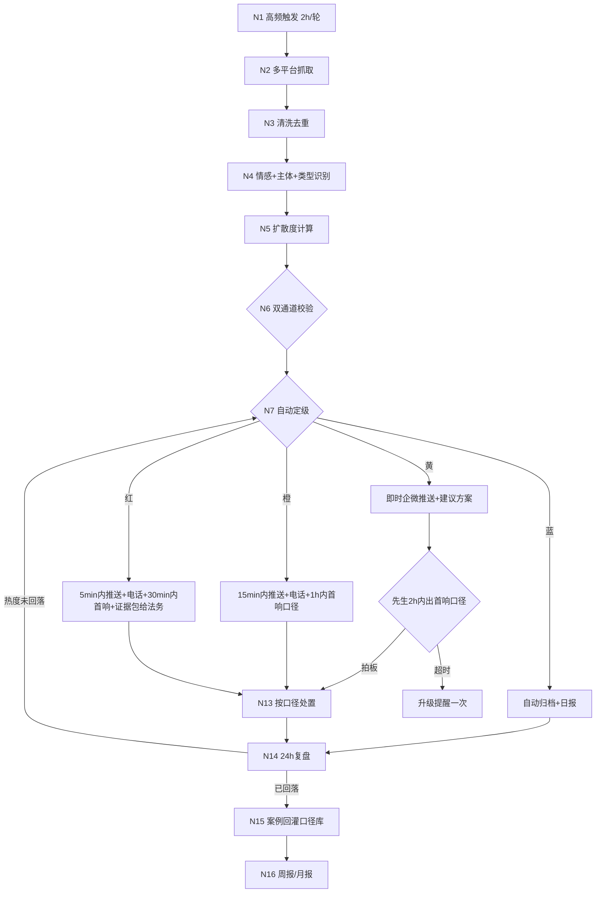

# 09-舆情自动化分析流水线SOP-采集研判处置

> **版本：** V1.1
> **日期：** 2026-09-26
> **用途：** 在现有人工监测体系（00-监测方案 / 01-监测清单 / 02-分级响应）之上，建一条自动化的舆情采集→研判→定级→响应流水线，减轻人工巡查负担，缩短橙/红级发现时间
> **核心原则：** 分级口径沿用 02-SOP（蓝/黄/橙/红），**不改标准，只提速度**；响应决策权始终在人。02 时限已对齐 KB《舆情防控与宣传策略SOP》定稿（首响 黄2h/橙1h/红30min + 上报时限 黄即时/橙15min/红5min）
> **关联：** 02-分级响应SOP、03-常见场景预案、04-记录模板、05/08-周报月报模板、58-评论驱动内容生产SOP（其风险分支喂入本流水线）

---

## 一、与现有体系的关系

| 现有资产 | 本流水线怎么用 |
|---------|---------------|
| 00-监测平台矩阵（8平台覆盖度） | 采集节点的平台清单，自动化优先做覆盖度高的（抖音60%/高德70%/百度70%） |
| 01-监测清单（关键词+频次+负责人） | 关键词库直接导入自动化监测，谣将巡查从「每日2次」降为「每日1次复核」 |
| 02-分级响应（蓝/黄/橙/红） | 定级节点的输出标准，**一字不改** |
| 03-常见场景预案 | 处置节点的回应口径库，蓝色级可自动引用 |
| 05/08-周报月报模板 | 自动填充数据源 |

---

## 二、五阶段流程

### 阶段 1：采集（全自动，高频）
1. **N1 触发**：关键词监测每 2 小时一轮（品牌词/业态词/楼栋词/高管词四组，来自 01-清单）；点评/美团评分每日早晚各一次；校园渠道（表白墙/贴吧/社群）由校内合伙人经标准表单上报，实时进池
2. **N2 抓取**：CDP/平台通道抓取新内容（正文+互动数+作者粉丝量）
3. **N3 清洗去重**：去广告/水军/重复/已归档，按「平台+内容指纹+24h窗」去重

### 阶段 2：研判（全自动，Jev & Laya 系统1模型）

> **研判层模型分工（v0.2 修订）**：Laya 本地跑高频研判（情感初判/主体识别），黄级以上或阈值边缘样本追加 Jev API 复核；双通道不一致取更严重档；规则引擎兑底。判定实现见 `looppark-content-automation\decision_engine\jev_laya_decision.py`

4. **N4 情感与主体识别**：极性（正/中/负）+ 主体（哪个楼栋/业态/商户/活动）+ 内容类型（事实投诉/主观抱怨/谣言/竞品攻击/无关）
5. **N5 扩散度计算**：量化指标——互动增速（条/小时）、作者影响力分层（素人/KOC/小V/大V）、是否上同城榜/热搜、跨平台出现次数
6. **N6 双通道校验**：Laya 本地研判 + 规则引擎（关键词命中/数值阈值）并行；命中黄级以上或阈值边缘时追加 Jev API 复核，**两者结论不一致时取更严重的一档**（宁高勿低）

### 阶段 3：定级（全自动，映射 02-SOP）
7. **N7 自动定级**：按 02-SOP 定义映射蓝/黄/橙/红，叠加扩散度修正（如蓝色内容 2 小时内互动增速异常 → 自动升黄）
8. **N8 证据固化**：截图+链接+时间戳存档（橙/红强制，蓝/黄按需），供决策与法务备用

### 阶段 4：分级响应（响应决策 = 人工卡点）
9. **N9 蓝**：自动归档 + 进舆情日报，不推送不打扰；可自动引用 03-预案口径进行评论区回复（灰度期仍人工发）
10. **N10 黄**：发现即时企微推送先生+风谣（内容/定级依据/建议方案），**2 小时内出首响口径**、拍板后执行
11. **N11 橙**：15 分钟内企微+电话双通道推先生，1 小时内出首响口径，自动发起八将紧急会议流程，统一口径前**任何账号不得回应**
12. **N12 红**：5 分钟内推送+电话，30 分钟内出首响口径，同步证据包给法务；现场处置优先于线上回应
13. **超时规则**：黄级超 2h 未出首响口径 → 升级提醒一次；橙/红不存在超时，未响应电话持续打

### 阶段 5：处置闭环
14. **N13 处置执行**：按拍板口径回应/下架/补偿/澄清，进度记入 04-记录模板
15. **N14 24h 复盘**：事件热度是否回落；未回落自动升一级重推
16. **N15 案例回灌**：处置完成的事件沉淀进 03-预案口径库 + 知识库，同类事件下次自动带出历史口径
17. **N16 周报/月报**：按 05/08 模板自动填充（数量/分级分布/响应时长/处置结果），推送先生

---

## 三、流程图（Mermaid）

---

## 四、节点平台落点

与 SOP 58 同一套混合架构：**外部编排（n8n/Dify/脚本）跑全部节点 + 企微做响应卡点**。本流水线没有出图需求，ComfyUI 不参与。研判节点用 **Laya 本地系统1模型为主通道（结构化 JSON 输出：极性/主体/类型/建议定级四字段）**，Jev API 做第二通道复核，规则引擎兑底校验；生成类需求才调大模型。

---

## 五、风险标注

1. **误报疲劳**：定级宁高勿低会增加误报 → 蓝色级不推送设计就是为了保护注意力；每周复盘误报率，调关键词库
2. **漏报**：自动化覆盖不了暗处（私群/线下口口相传）→ 校内合伙人人工通道保留，是兜底不是冗余
3. **自动回复风险**：蓝级自动引用口径回复，灰度期必须人工发；稳定后也仅限「模板化安抚话术」，涉及补偿/承诺的一律人工
4. **谣言处置**：谣言类不进内容池回应，先证据固化，橙级以上由统一口径澄清，个人账号不下场对线
5. **与 02-SOP 冲突时**：分级标准与响应时限以 02 为准（02 已对齐 KB《舆情防控与宣传策略SOP》定稿），本 SOP 只提「发现速度」和「执行留痕」

---

*定稿端：LOOP-PARK-SOP（GitHub: loop-park-sop）；依据 CANON V2.18；定稿后回流登记 Xloop-KB REGISTRY。*
